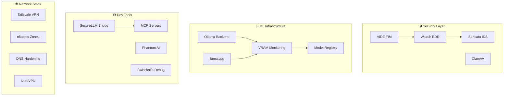

# Enterprise-Grade NixOS Configuration

> 🏆 **Production System** | 226 Modules | 35,000 Lines | Security Score: 100/100

A comprehensive, hardened NixOS configuration showcasing advanced system architecture, ML infrastructure, and enterprise security practices. Perfect for portfolios demonstrating expertise in infrastructure-as-code, security engineering, and DevOps.

[](https://nixos.org)
[](https://github.com/VoidNxSEC/nixos/actions/workflows/nixos-public.yml)
[](https://gitlab.com/VoidNxSEC/nixos)
[](#security-suite)
[](arch/AI-ARCHITECTURE-REPORT.md)
[](arch/ARCHITECTURE-REPORT.md)
[](#cicd-pipeline)
[](https://app.cachix.org)
[](#security-notice)
[](#deployment)

---

## 🎯 What Makes This Special

This isn't just a NixOS config—it's a showcase of production-grade system engineering:

- **🤖 ML Infrastructure** - Full GPU orchestration stack with Ollama + llama.cpp backends
- **🔒 Defense-in-Depth Security** - 17 security modules including SOC/SIEM stack  
- **📦 Custom Package System** - Sandboxed package management with audit trails
- **🛠️ Developer Experience** - SecureLLM Bridge, MCP servers, AI-powered tooling
- **📊 Observable Systems** - Complete monitoring stack (Prometheus, Grafana, Wazuh, Suricata)
- **🚀 Production-Ready** - Used daily on development workstation since 2025

---

## 📊 Architecture at a Glance



### By the Numbers

| Category | Modules | Highlights |
|----------|---------|------------|
| **📦 Packages** | 36 | Custom sandboxed package system |
| **🛠️ Shell** | 35 | 674-line advanced rebuild system |
| **🤖 ML** | 22 | Full model orchestration stack |
| **🔒 Security** | 17 | AIDE, ClamAV, Wazuh, Suricata |
| **🔧 Services** | 16 | GPU orchestration, MCP servers |
| **📊 SOC** | 14 | Complete SIEM stack |
| **🌐 Network** | 12 | Tailscale, VPN, DNS hardening |
| **🖥️ Hardware** | 12 | Thermal forensics, NVIDIA optimization |

**Total**: 21 categories, 226 modules, 34,953 lines of configuration

---

## 🚀 Key Features

### 1. ML Infrastructure (22 modules)

Complete GPU-accelerated ML stack integrated into NixOS:

```nix
# One line to enable entire ML stack
kernelcore.ml.offload.enable = true;
```

**Features:**
- ✅ **Multi-Backend Support** - Ollama + llama.cpp with VRAM monitoring
- ✅ **Model Registry** - SQLite database with auto-discovery
- ✅ **REST API** - Unified control interface (port 9000)
- ✅ **GPU Orchestration** - Automatic model unloading, memory management
- ✅ **MCP Integration** - Model Context Protocol for IDE integration
- 📋 **Planned**: vLLM and TGI backends for high-throughput scenarios

**Implementation Highlights:**
- Real-time VRAM monitoring with budget planning
- Automatic model offloading based on GPU pressure
- Rust-based REST API for performance
- Integration with SecureLLM Bridge for provider management

### 2. Security Suite (17 + 14 SOC modules)

Defense-in-depth architecture with enterprise SOC/SIEM capabilities:

**File Integrity & Antivirus:**
- AIDE - Real-time file integrity monitoring
- ClamAV - Scheduled virus scanning with auto-updates

**Endpoint Security:**
- Wazuh EDR - Unified XDR/SIEM platform
- Suricata IDS/IPS - Network intrusion detection
- AppArmor - Mandatory access control profiles

**Hardening:**
- Kernel hardening (sysctl, boot parameters)
- Compiler hardening (PIE, RELRO, stack protection)
- SSH hardening (key-only auth, port knocking)
- SELinux-level filesystem restrictions

**Monitoring Stack:**
- OpenSearch - Log storage and SIEM
- Grafana - Metrics visualization  
- Vector - Centralized log aggregation
- Threat Intelligence - Auto-updating threat feeds

```nix
kernelcore.soc.enable = true;           # Complete SOC stack
kernelcore.security.hardening.enable = true;
```

### 3. Custom Package Management (36 modules)

Unique sandboxed package system with security auditing:

**Package Types:**
- `.deb` packages with Firejail isolation
- `tar.gz` extraction with FHS environment
- `npm` packages with sandbox profiles
- Custom package builders with audit trails

**Features:**
- Automatic hash verification
- GitHub release tracking (nvd)
- Security audit logging
- Sandboxed execution (Firejail/Bubblewrap)

**Example Packages:**
- AppFlowy (custom build with zenity integration)
- Gemini CLI (npm package with MCP)
- Proton Suite (Pass, VPN)
- Cursor, Antigravity (AI IDEs)

### 4. Developer Tools Suite (9 + 5 modules)

AI-powered development experience integrated system-wide:

**SecureLLM Bridge** - Multi-provider LLM orchestration:
```nix
services.securellm-mcp.enable = true;
```
- Unified API for OpenAI, Anthropic, AWS Bedrock, local models
- Rate limiting and cost tracking
- Automatic provider fallback
- MCP server integration

**Tools CLI** - Unified command suite:
```bash
nix-utils     # Nix utilities (hash, rebuild, emergency)
secops        # Security operations (scan, audit, report)
diagnostics   # System diagnostics (thermal, GPU, logs)
llm           # Local LLM interface
mcp           # MCP server management
```

**Swissknife Debug** - System forensics toolkit:
- Thermal forensics (3-phase stress testing)
- VRAM war room (real-time monitoring)
- Emergency abort procedures
- Build reproducibility analysis

**Development Environments:**
```bash
nix develop .#python    # Python with ML libs
nix develop .#cuda      # CUDA development
nix develop .#rust      # Rust toolchain
nix develop .#infra     # Infrastructure tools
```

### 5. Network Security (12 modules)

Enterprise-grade networking with zero-trust principles:

- **Tailscale Mesh VPN** - Zero-config peer-to-peer networking
- **NordVPN Integration** - Kill-switch and post-quantum encryption
- **Firewall Zones** - nftables-based network segmentation  
- **DNS Hardening** - DNSCrypt, DNS-over-TLS, caching
- **NGINX Reverse Proxy** - Tailscale service exposure
- **Network Monitoring** - Real-time connection tracking

### 6. Desktop Environments (4 modules)

Modern Wayland + classic X11 with glassmorphism theming:

**Hyprland** (Wayland):
- Custom v0.52.2 overlay  
- Glassmorphism aesthetics
- GPU-accelerated animations
- Waybar + Wofi + Wlogout

**i3** (X11):
- Lightweight alternative
- Polybar integration
- Rofi launcher
- Picom compositor

---

## 🏗️ Technical Highlights

### Architecture Patterns

This repository demonstrates:

1. **Modular Design** - 21 categories, each with cohesive responsibility
2. **Security-First** - Security modules imported last (highest priority)
3. **Infrastructure as Code** - Full system declaratively defined
4. **Reproducibility** - Locked dependencies via Flakes
5. **Observability** - Comprehensive logging and monitoring

### Notable Implementations

**Thermal Forensics Framework** (760 lines):
```bash
# 3-phase stress testing with evidence collection
thermal-forensics --duration 180
laptop-verdict /var/lib/thermal-evidence
```
Collects baseline → stress → rebuild thermal data for hardware warranty claims.

**Advanced Rebuild System** (674 lines):
```bash
# Pre-flight checks + rebuild + thermal monitoring + binary cache
rebuild-advanced --profile workstation --check-thermal
```
Integrated safety checks prevent system damage during rebuilds.

**GPU Orchestration** (252 lines):
Automatically unloads Ollama models when VRAM &lt; 2GB, maintains service priority queues.

**SOC SIEM Stack** (Complete Wazuh + OpenSearch + Suricata):
Production-grade security operations center running on a laptop.

---

## 📁 Repository Structure

```
/etc/nixos/
├── flake.nix                     # Main entry point
├── modules/                      # 226 NixOS modules
│   ├── ml/                       # ML infrastructure (22 modules)
│   ├── security/                 # Security hardening (17 modules)
│   ├── soc/                      # SOC/SIEM stack (14 modules)
│   ├── packages/                 # Custom packages (36 modules)
│   ├── shell/                    # Shell config (35 modules)
│   ├── services/                 # System services (16 modules)
│   ├── network/                  # Networking (12 modules)
│   ├── hardware/                 # Hardware opts (12 modules)
│   └── ...                       # 13 more categories
├── hosts/kernelcore/             # Host-specific config
├── overlays/                     # Package overlays (Hyprland)
├── lib/                          # Reusable functions
├── secrets/                      # SOPS-encrypted secrets
├── arch/                         # Architecture documentation
└── docs/                         # User documentation
```

---

## 🎓 Skills Demonstrated

This repository showcases expertise in:

### Infrastructure & DevOps
- ✅ **Nix/NixOS** - Advanced flake usage, custom modules, overlays
- ✅ **Infrastructure as Code** - Declarative system configuration
- ✅ **Reproducible Builds** - Locked dependencies, binary caching
- ✅ **Secret Management** - SOPS + age encryption

### Security Engineering
- ✅ **Threat Modeling** - Defense-in-depth architecture
- ✅ **SIEM/SOC** - Wazuh, OpenSearch, Suricata integration
- ✅ **Hardening** - Kernel, compiler, application sandboxing
- ✅ **Compliance** - Audit logging, file integrity monitoring

### Systems Programming
- ✅ **Bash Scripting** - Complex shell utilities (35 modules)
- ✅ **Rust** - MCP server, SecureLLM Bridge integration
- ✅ **Python** - AI tooling, system monitoring, ML orchestration
- ✅ **GPU Programming** - CUDA optimization, VRAM management

### ML/AI Integration
- ✅ **LLM Deployment** - Ollama, llama.cpp, model management
- ✅ **GPU Orchestration** - Resource management, auto-unloading
- ✅ **MCP Protocol** - IDE integration for AI assistants
- ✅ **ML Ops** - Model registry, VRAM monitoring, API gateway

---

## 🚀 Quick Start

### Prerequisites
- NixOS 23.11+ or nixos-unstable
- NVIDIA GPU (optional, for ML features)
- Git

### Installation

```bash
# Clone repository
git clone https://github.com/VoidNxSEC/nixos.git /etc/nixos
cd /etc/nixos

# Review configuration
cat hosts/kernelcore/configuration.nix

# Build system (dry-run first)
sudo nixos-rebuild build --flake .#kernelcore

# Apply configuration
sudo nixos-rebuild switch --flake .#kernelcore
```

### Configuration

Feature flags in `flake.nix`:

```nix
{
  # ML Infrastructure
  kernelcore.ml.offload.enable = true;
  
  # Security Suite
  kernelcore.soc.enable = true;
  kernelcore.security.hardening.enable = true;
  
  # Developer Tools
  services.securellm-mcp.enable = true;
  kernelcore.tools.enable = true;
  kernelcore.swissknife.enable = true;
}
```


---

## 🚀 CI/CD Pipeline

Enterprise-grade continuous integration and deployment infrastructure:

### GitHub Actions Workflow

**[nixos-build.yml](file:///.github/workflows/nixos-build.yml)** - Complete build, test, and deploy pipeline:

**Jobs:**
1. **setup-secrets** - SOPS secret decryption
2. **check** - Flake syntax and metadata validation
3. **build** - Matrix builds (toplevel, ISO, VM image)
4. **test-modules** - Dev shells, Docker images, systemd services
5. **security** - Vulnix CVE scanning, secret detection
6. **format** - Code formatting validation
7. **deploy** - Automated deployment to main branch
8. **report** - Build summaries and notifications

**Features:**
- ✅ Self-hosted runner on NixOS
- ✅ Cachix binary cache integration
- ✅ Multi-target matrix builds
- ✅ Automated deployment on merge to main
- ✅ Security vulnerability scanning
- ✅ Build artifact retention

### GitLab CI Pipeline

**[.gitlab-ci.yml](file:///.gitlab-ci.yml)** - 4-stage validation pipeline:

**Stages:**
1. **Check** - Flake validation, format checks
2. **Build** - System configuration, ISO image
3. **Test** - Module testing
4. **Security** - Vulnix + Trivy scans, GitLab Pages reports

**Features:**
- ✅ Docker-based Nix environment
- ✅ Artifact caching for faster builds
- ✅ Security report publishing
- ✅ Multi-platform support

### Deployment

**Automated CD:**
```yaml
# Triggers automatic deployment:
- Push to main branch (GitHub Actions)
- Manual workflow_dispatch
- Tag creation (GitLab CI)
```

**Safety Checks:**
- Pre-flight flake validation
- Security vulnerability scanning
- Systemd service verification
- Post-deployment health checks

### Binary Cache

**Cachix Integration:**
- Cache name: `marcosfpina`
- Automatic push from CI/CD
- Shared cache across builds
- Significantly reduced build times

---

## 📚 Documentation

- [AI Architecture Analysis](arch/AI-ARCHITECTURE-REPORT.md) - AI-powered analysis (qwen2.5-coder)
- [Architecture Blueprint](docs/ARCHITECTURE-BLUEPRINT.md) - Design decisions
- [Technical Overview](docs/TECHNICAL-OVERVIEW.md) - Quick reference
- [Module Template Guide](modules/TEMPLATE_GUIDE.md) - Creating new modules

---

## 🔐 Security Notice

This repository demonstrates production security practices:

- **Environment**: Production workstation
- **Security Level**: Hardened (Score: 100/100)
- **Data Sensitivity**: High (SOPS-encrypted secrets)
- **Compliance**: Defense-in-depth architecture

All sensitive data (API keys, SSH keys, certificates) is encrypted using SOPS with age.

---

## 🏆 Stats

**Repository Metrics:**
- 📊 **Modules**: 226 across 21 categories
- 📝 **Lines of Code**: 34,953
- 🔒 **Security Modules**: 31 (17 security + 14 SOC)
- 🤖 **ML Modules**: 22
- 📦 **Custom Packages**: 36
- 🛠️ **Shell Scripts**: 35 modules

**Complexity Distribution:**
- 🟢 Low: 156 modules (69%)
- 🟡 Medium: 68 modules (30%)  
- 🟠 High: 2 modules (1%)

**Largest Modules:**
1. `vmctl` - 959 lines (VM orchestration CLI)
2. `thermal-forensics` - 760 lines (Hardware evidence collection)
3. `rebuild-advanced` - 674 lines (Safe rebuild system)

---

## 📜 License

MIT License - See details in root directory

---

## 🙏 Acknowledgments

Built with excellent open-source projects:
- [NixOS](https://nixos.org) - Declarative Linux distribution
- [Hyprland](https://hyprland.org) - Modern Wayland compositor
- [Wazuh](https://wazuh.com) - Open-source XDR/SIEM
- [Ollama](https://ollama.ai) - Local LLM deployment

---

**Maintained by**: [@VoidNxSEC](https://github.com/VoidNxSEC)  
**Hardware**: Lenovo ThinkPad + NVIDIA GPU  
**NixOS Version**: Unstable channel  
**Status**: Production (Daily Driver)

---

<p align="center">
  <i>Showcasing enterprise-grade infrastructure-as-code, security engineering, and ML/AI integration</i>
</p>