# 🤖 AI-Powered Architecture Analysis Report

> **Generated**: 2025-12-16T01:40:14.329080
> **Model**: `qwen2.5-coder:7b-instruct`
> **Repository**: `/etc/nixos`
> **Analysis Duration**: 1529.7s

---

## 📋 Executive Summary

The NixOS repository contains a large number of modules, with a significant focus on security and system configuration. The architecture is organized into categories such as packages, shell, services, and hardware, but there are also some less common categories like debug and virtualization.

### Quick Stats

| Metric             | Value   |
| ------------------ | ------- |
| **Total Modules**  | 226     |
| **Total Lines**    | 34,953  |
| **Categories**     | 21      |
| **Security Score** | 100/100 |

---

## 📊 Category Breakdown

| Category           | Modules | Description |
| ------------------ | ------- | ----------- |
| **packages**       | 36      | -           |
| **shell**          | 35      | -           |
| **ml**             | 22      | -           |
| **security**       | 17      | -           |
| **services**       | 16      | -           |
| **soc**            | 14      | -           |
| **hardware**       | 12      | -           |
| **network**        | 12      | -           |
| **system**         | 10      | -           |
| **tools**          | 9       | -           |
| **applications**   | 8       | -           |
| **development**    | 5       | -           |
| **secrets**        | 5       | -           |
| **containers**     | 4       | -           |
| **debug**          | 4       | -           |
| **desktop**        | 4       | -           |
| **virtualization** | 4       | -           |
| **programs**       | 4       | -           |
| **audio**          | 3       | -           |
| **TEMPLATE.nix**   | 1       | -           |
| **\_sources**      | 1       | -           |

---

## 🔗 Dependency Graph

```mermaid
graph TD
    subgraph TEMPLATE.nix
        TEMPLATE[TEMPLATE]
    end
    subgraph _sources
        generated[generated]
    end
    subgraph applications
        brave-secure[brave-secure]
        chromium[chromium]
        default[default]
        firefox-privacy[firefox-privacy]
        nemo-full[nemo-full]
        vscode-secure[vscode-secure]
        vscodium-secure[vscodium-secure]
        zellij[zellij]
    end
    subgraph audio
        default[default]
        production[production]
        video-production[video-production]
    end
    subgraph containers
        default[default]
        docker[docker]
        nixos-containers[nixos-containers]
        podman[podman]
    end
    subgraph debug
        debug-init[debug-init]
        default[default]
        test-init[test-init]
        tools-integration[tools-integration]
    end
    subgraph desktop
        default[default]
        hyprland[hyprland]
        i3-lightweight[i3-lightweight]
        yazi[yazi]
    end
    subgraph development
        cicd[cicd]
        claude-profiles[claude-profiles]
        default[default]
        environments[environments]
        jupyter[jupyter]
    end
    subgraph hardware
        bluetooth[bluetooth]
        default[default]
        default[default]
        flake[flake]
        intel[intel]
        lenovo-throttled[lenovo-throttled]
        mcp-integration[mcp-integration]
        nvidia[nvidia]
        rebuild-hooks[rebuild-hooks]
        thermal-profiles[thermal-profiles]
    end
    subgraph ml
        config[config]
        database[database]
        default[default]
        default[default]
        default[default]
        default[default]
        default[default]
        default[default]
        default[default]
        default[default]
    end
    subgraph network
        bridge[bridge]
        default[default]
        default[default]
        dns-resolver[dns-resolver]
        firewall-zones[firewall-zones]
        nginx-tailscale[nginx-tailscale]
        nordvpn[nordvpn]
        tailscale[tailscale]
        tailscale-desktop[tailscale-desktop]
        tailscale-laptop[tailscale-laptop]
    end
    subgraph packages
        all[all]
        antigravity[antigravity]
        appflowy[appflowy]
        appflowy[appflowy]
        audit[audit]
        build-gemini[build-gemini]
        builder[builder]
        builder[builder]
        builder[builder]
        builders[builders]
    end
    subgraph programs
        cognitive-vault[cognitive-vault]
        default[default]
        phantom[phantom]
        vmctl[vmctl]
    end
    subgraph secrets
        api-keys[api-keys]
        aws-bedrock[aws-bedrock]
        default[default]
        sops-config[sops-config]
        tailscale[tailscale]
    end
    subgraph security
        aide[aide]
        audit[audit]
        auto-upgrade[auto-upgrade]
        boot[boot]
        clamav[clamav]
        compiler-hardening[compiler-hardening]
        default[default]
        dev-directory-hardening[dev-directory-hardening]
        hardening[hardening]
        hardening-template[hardening-template]:::high
    end
    subgraph services
        actions[actions]
        claude-code[claude-code]
        codex-agent[codex-agent]
        config-auditor[config-auditor]
        default[default]
        default[default]
        gemini-agent[gemini-agent]
        gitlab-runner[gitlab-runner]
        gpu-orchestration[gpu-orchestration]
        laptop-builder-client[laptop-builder-client]
    end
    subgraph shell
        analytics[analytics]
        aws[aws]
        build[build]
        compose[compose]
        default[default]
        default[default]
        default[default]
        default[default]
        default[default]
        default[default]
    end
    subgraph soc
        alerting[alerting]
        default[default]
        dns-monitor[dns-monitor]
        edr[edr]
        fim[fim]
        grafana[grafana]
        log-aggregator[log-aggregator]
        netflow[netflow]
        opensearch[opensearch]
        options[options]
    end
    subgraph system
        aliases[aliases]
        binary-cache[binary-cache]
        default[default]
        emergency-monitor[emergency-monitor]
        io-scheduler[io-scheduler]
        memory[memory]:::high
        ml-gpu-users[ml-gpu-users]
        nix[nix]
        services[services]
        ssh-config[ssh-config]
    end
    subgraph tools
        default[default]
        dev[dev]
        diagnostics[diagnostics]
        intel[intel]
        llm[llm]
        mcp[mcp]
        nix-utils[nix-utils]
        secops[secops]
        secrets[secrets]
    end
    subgraph virtualization
        default[default]
        macos-kvm[macos-kvm]
        vmctl[vmctl]
        vms[vms]
    end
    actions --> config
    build --> config
    builder --> builders
    builder --> fetchers
    builders --> sandbox
    chromium --> config
    gitlab-runner --> config
    js-packages --> types
    js-packages --> builder
    run --> config
    wazuh --> config

    classDef critical fill:#ff6b6b,stroke:#c92a2a
    classDef high fill:#ffd43b,stroke:#f59f00
```

---

## 📦 Module Analysis

### TEMPLATE.nix/

| Module     | Purpose                                                         | Complexity | Lines |
| ---------- | --------------------------------------------------------------- | ---------- | ----- |
| `TEMPLATE` | This module provides a template for creating NixOS modules w... | 🟢 low     | 106   |

### \_sources/

| Module      | Purpose                                                         | Complexity | Lines |
| ----------- | --------------------------------------------------------------- | ---------- | ----- |
| `generated` | This module defines sources for various software packages us... | 🟢 low     | 39    |

### applications/

| Module            | Purpose                                                         | Complexity | Lines |
| ----------------- | --------------------------------------------------------------- | ---------- | ----- |
| `chromium`        | This module configures and wraps Chromium with organization-... | 🟡 medium  | 355   |
| `vscode-secure`   | This module configures Visual Studio Code with Firejail sand... | 🟡 medium  | 298   |
| `vscodium-secure` | This module configures VSCodium with Firejail sandboxing and... | 🟡 medium  | 282   |
| `zellij`          | Manages the installation and configuration of Zellij with op... | 🟡 medium  | 252   |
| `firefox-privacy` | Configures Firefox with privacy settings and optional harden... | 🟡 medium  | 210   |
| `brave-secure`    | This module configures Brave browser with Firejail for enhan... | 🟡 medium  | 208   |
| `nemo-full`       | Configures Nemo as a file manager with additional features a... | 🟡 medium  | 148   |
| `default`         | Imports all application-specific configurations for browsers... | 🟢 low     | 25    |

### audio/

| Module             | Purpose                                                         | Complexity | Lines |
| ------------------ | --------------------------------------------------------------- | ---------- | ----- |
| `production`       | Configures an audio production environment with various tool... | 🟡 medium  | 646   |
| `video-production` | Configures an NixOS environment for professional video produ... | 🟡 medium  | 402   |
| `default`          | Aggregates audio-related NixOS modules for production and vi... | 🟢 low     | 8     |

### containers/

| Module             | Purpose                                                         | Complexity | Lines |
| ------------------ | --------------------------------------------------------------- | ---------- | ----- |
| `nixos-containers` | Enables NixOS containers support with network and firewall c... | 🟡 medium  | 192   |
| `podman`           | This module configures Podman container support in NixOS, in... | 🟡 medium  | 111   |
| `docker`           | Enables Docker container support in NixOS                       | 🟢 low     | 42    |
| `default`          | Imports all container runtime configurations for Docker, Pod... | 🟢 low     | 16    |

### debug/

| Module              | Purpose                                                         | Complexity | Lines |
| ------------------- | --------------------------------------------------------------- | ---------- | ----- |
| `debug-init`        | Provides utilities for debugging configuration issues and pe... | 🟢 low     | 175   |
| `test-init`         | Provides utilities for safely testing NixOS configuration ch... | 🟢 low     | 75    |
| `tools-integration` | Integrates Swissknife Debug Tools into NixOS for professiona... | 🟢 low     | 51    |
| `default`           | Aggregates various debug-related NixOS modules                  | 🟢 low     | 9     |

### desktop/

| Module           | Purpose                                                         | Complexity | Lines |
| ---------------- | --------------------------------------------------------------- | ---------- | ----- |
| `i3-lightweight` | Configures a lightweight desktop environment using the i3 wi... | 🟡 medium  | 567   |
| `hyprland`       | Configures a pure Wayland desktop environment using Hyprland... | 🟡 medium  | 274   |
| `yazi`           | Installs the Yazi text editor on the system level.              | 🟢 low     | 18    |
| `default`        | Aggregates and imports various desktop environments for NixO... | 🟢 low     | 16    |

### development/

| Module            | Purpose                                                         | Complexity | Lines |
| ----------------- | --------------------------------------------------------------- | ---------- | ----- |
| `claude-profiles` | Provides a shell script for managing API profiles for Claude... | 🟢 low     | 428   |
| `cicd`            | Enables CI/CD development tools and pre-commit hooks in NixO... | 🟡 medium  | 313   |
| `jupyter`         | This module configures a Jupyter notebook environment with v... | 🟡 medium  | 148   |
| `environments`    | This module configures development environments for Rust, Go... | 🟢 low     | 74    |
| `default`         | Aggregates various development-related NixOS modules            | 🟢 low     | 10    |

### hardware/

| Module              | Purpose                                                         | Complexity | Lines |
| ------------------- | --------------------------------------------------------------- | ---------- | ----- | --- |
| `flake`             | This module provides a framework for collecting thermal fore... | 🟡 medium  | 760   | M   |
| `thermal-profiles`  | Manages thermal profiles for hardware components such as Int... | 🟡 medium  | 358   |
| `rebuild-hooks`     | This module integrates thermal safety checks and evidence co... | 🟡 medium  | 321   |
| `intel`             | Configures various aspects of Intel hardware on NixOS, inclu... | 🟡 medium  | 253   |
| `lenovo-throttled`  | This module configures thermal management and power limits f... | 🟡 medium  | 201   |
| `nvidia`            | Configures NVIDIA hardware and related services on NixOS        | 🟡 medium  | 194   |
| `mcp-integration`   | Adds thermal forensics and safety check tools to an MCP serv... | 🟢 low     | 186   |
| `wifi-optimization` | This module optimizes WiFi performance on NixOS systems by c... | 🟡 medium  | 173   |
| `trezor`            | This module configures Trezor hardware wallets for use as SS... | 🟢 low     | 162   |
| `bluetooth`         | Enables Bluetooth support with GUI management on NixOS          | 🟢 low     | 47    |
| `default`           | Provides configuration options for the Intel i915 Memory Gov... | 🟢 low     | 36    |
| `default`           | Imports all hardware-specific configurations for NixOS          | 🟢 low     | 21    |

### ml/

| Module           | Purpose                                                         | Complexity | Lines |
| ---------------- | --------------------------------------------------------------- | ---------- | ----- |
| `flake`          | This module sets up a unified ML model orchestration system ... | 🟡 medium  | 262   |
| `monitoring`     | Manages VRAM usage for GPU-intensive machine learning applic... | 🟡 medium  | 241   |
| `manager`        | Manages ML model offloading via a REST API service              | 🟡 medium  | 239   |
| `llama-cpp`      | This module configures and manages the LLaMA C++ server with... | 🟡 medium  | 206   |
| `database`       | Manages an ML model registry with auto-discovery and metadat... | 🟡 medium  | 167   |
| `config`         | Configures MCP (Model Context Protocol) for NixOS systems, i... | 🟡 medium  | 139   |
| `gpu-manager`    | Manages Ollama GPU models by automatically unloading them wh... | 🟡 medium  | 132   |
| `storage`        | This module configures the storage structure and management ... | 🟡 medium  | 129   |
| `llama-cpp-swap` | This module configures and manages the llama-swap service, w... | 🟡 medium  | 124   |
| `default`        | Configures the ML Offload unified system with multi-backend ... | 🟢 low     | 71    |
| `default`        | Aggregates ML backend drivers and provides a standard interf... | 🟢 low     | 51    |
| `default`        | Aggregates various ML-related modules for NixOS                 | 🟢 low     | 30    |
| `default`        | Imports and configures ML inference services like llama.cpp ... | 🟢 low     | 19    |
| `default`        | Imports and organizes ML infrastructure modules such as stor... | 🟢 low     | 17    |
| `default`        | Imports and organizes ML integrations modules such as MCP se... | 🟢 low     | 16    |
| `default`        | Manages ML applications as independent flakes in the project... | 🟢 low     | 16    |
| `default`        | This module sets up a model registry for ML models, includin... | 🟢 low     | 16    |
| `default`        | Manages GPU VRAM allocation through monitoring and schedulin... | 🟢 low     | 16    |
| `default`        | Imports and configures the Ollama inference service with GPU... | 🟢 low     | 16    |
| `default`        | Imports configuration for the Model Context Protocol (MCP) s... | 🟢 low     | 16    |
| `default`        | Provides a base configuration for hardware settings related ... | 🟢 low     | 15    |
| `default`        | Provides ML features for Neovim integration                     | 🟢 low     | 15    |

### network/

| Module               | Purpose                                                         | Complexity | Lines |
| -------------------- | --------------------------------------------------------------- | ---------- | ----- |
| `tailscale-monitor`  | This module sets up a monitoring script for Tailscale connec... | 🟡 medium  | 450   |
| `tailscale`          | Configures Tailscale VPN on NixOS with various options for a... | 🟡 medium  | 447   |
| `firewall-zones`     | This module configures firewall zones using nftables for net... | 🟡 medium  | 365   |
| `nginx-tailscale`    | Configures an NGINX reverse proxy for Tailscale services wit... | 🟡 medium  | 321   |
| `nordvpn`            | Manages NordVPN configuration and integration with NixOS        | 🟡 medium  | 309   |
| `dns-resolver`       | Configures DNS resolver settings for network performance and... | 🟡 medium  | 284   |
| `tailscale-desktop`  | Configures Tailscale for a desktop machine to act as a subne... | 🟢 low     | 170   |
| `default`            | This module configures and installs a DNS proxy with caching... | 🟢 low     | 147   |
| `tailscale-services` | Configures Tailscale and NGINX for service exposure in a Nix... | 🟡 medium  | 134   |
| `tailscale-laptop`   | Configures Tailscale for a mobile development workstation on... | 🟢 low     | 97    |
| `bridge`             | Manages a NetworkManager bridge interface (br0) with optiona... | 🟢 low     | 84    |
| `default`            | Aggregates network proxy-related NixOS modules                  | 🟢 low     | 8     |

### packages/

| Module         | Purpose                                                         | Complexity | Lines |
| -------------- | --------------------------------------------------------------- | ---------- | ----- |
| `audit`        | This module configures an audited version of a package with ... | 🟡 medium  | 275   |
| `builders`     | Provides functions to build FHS and native package environme... | 🟡 medium  | 228   |
| `types`        | Provides shared type definitions for package modules in NixO... | 🟢 low     | 226   |
| `example`      | This module defines configurations for various .deb packages... | 🟢 low     | 175   |
| `default`      | Manages tar.gz packages with sandboxing and audit support       | 🟡 medium  | 151   |
| `sandbox`      | This module configures sandbox profiles for .deb packages on... | 🟡 medium  | 134   |
| `sandbox`      | This module defines sandbox profiles and functions to genera... | 🟢 low     | 132   |
| `fetchers`     | Provides unified fetch and extract logic for various package... | 🟢 low     | 111   |
| `default`      | Manages .deb packages with sandboxing and audit support         | 🟡 medium  | 110   |
| `default`      | This module provides a template for creating and managing De... | 🟢 low     | 103   |
| `builder`      | This module defines a function to build JavaScript packages ... | 🟡 medium  | 103   |
| `builder`      | Build tar.gz packages using shared builders and fetchers        | 🟡 medium  | 94    |
| `default`      | Installs Proton Pass, an end-to-end encrypted password manag... | 🟢 low     | 91    |
| `appflowy`     | This module defines a NixOS package for AppFlowy, an open-so... | 🟢 low     | 87    |
| `js-packages`  | Manages npm packages with sandboxing support in NixOS           | 🟢 low     | 86    |
| `gemini-cli`   | This module configures and installs the Google Gemini CLI to... | 🟢 low     | 82    |
| `default`      | This module defines a NixOS package for the Google Gemini CL... | 🟢 low     | 79    |
| `default`      | This module provides a template for creating NixOS packages ... | 🟢 low     | 74    |
| `default`      | This module defines a template for creating NixOS packages f... | 🟢 low     | 72    |
| `builder`      | Builds .deb packages using shared builders and fetchers         | 🟡 medium  | 62    |
| `lynis`        | Manages the installation and configuration of Lynis, a secur... | 🟢 low     | 62    |
| `protonpass`   | Installs and configures Proton Pass, an end-to-end encrypted... | 🟢 low     | 60    |
| `default`      | Installs and configures the Lynis security auditing tool        | 🟢 low     | 58    |
| `protonpass`   | This module defines a package for Proton Pass, an end-to-end... | 🟢 low     | 58    |
| `default`      | Installs Zellij, a terminal workspace with batteries include... | 🟢 low     | 55    |
| `protonvpn`    | This module defines configuration for installing and managin... | 🟢 low     | 52    |
| `antigravity`  | Configures the installation and environment for Google's Ant... | 🟢 low     | 48    |
| `appflowy`     | This module configures the installation and setup of AppFlow... | 🟢 low     | 47    |
| `zellij`       | This module configures the Zellij terminal multiplexer as a ... | 🟢 low     | 45    |
| `generated`    | This module defines package sources for various software pac... | 🟢 low     | 39    |
| `cursor`       | Configures the installation and environment for the Cursor A... | 🟢 low     | 39    |
| `codex`        | Installs and configures the Codex CLI tool                      | 🟢 low     | 35    |
| `build-gemini` | Builds the npm package 'gemini-cli' version '0.21.0-nightly.... | 🟢 low     | 31    |
| `default`      | Imports and organizes NixOS packages into a modular structur... | 🟢 low     | 28    |
| `default`      | Imports other NixOS modules related to JavaScript packages a... | 🟢 low     | 10    |
| `all`          | Merges configurations for various .deb packages from the pac... | 🟢 low     | 9     |

### programs/

| Module            | Purpose                                                         | Complexity | Lines |
| ----------------- | --------------------------------------------------------------- | ---------- | ----- |
| `phantom`         | This module integrates Phantom as a flake input for document... | 🟡 medium  | 169   |
| `vmctl`           | Manages the installation and configuration of vmctl, a light... | 🟢 low     | 85    |
| `cognitive-vault` | Provides configuration for installing and enabling the Cogni... | 🟢 low     | 31    |
| `default`         | Enables Sway window manager with XWayland support and import... | 🟢 low     | 12    |

### secrets/

| Module        | Purpose                                                         | Complexity | Lines |
| ------------- | --------------------------------------------------------------- | ---------- | ----- |
| `api-keys`    | Manages and loads API keys from encrypted files into the sys... | 🟢 low     | 155   |
| `sops-config` | Manages secrets using SOPS and AGE encryption tools             | 🟢 low     | 135   |
| `aws-bedrock` | Manages AWS Bedrock credentials and environment variables fo... | 🟢 low     | 108   |
| `tailscale`   | Manages Tailscale secrets using SOPS for encryption and ensu... | 🟢 low     | 59    |
| `default`     | Aggregates various secret management modules for NixOS confi... | 🟢 low     | 10    |

### security/

| Module                    | Purpose                                                         | Complexity | Lines |
| ------------------------- | --------------------------------------------------------------- | ---------- | ----- |
| `dev-directory-hardening` | Provides security hardening for a development directory by s... | 🟡 medium  | 444   |
| `aide`                    | This module configures and manages the AIDE (Advanced Intrus... | 🟡 medium  | 279   |
| `hardening-template`      | This module provides a comprehensive set of hardening config... | 🟠 high    | 243   |
| `ssh`                     | This module configures SSH on NixOS with security hardening ... | 🟡 medium  | 207   |
| `keyring`                 | Configures keyring support with GNOME Keyring and integrates... | 🟡 medium  | 194   |
| `nix-daemon`              | This module configures Nix daemon security settings, includi... | 🟡 medium  | 154   |
| `kernel`                  | This module configures kernel security hardening options in ... | 🟡 medium  | 137   |
| `clamav`                  | Configures and enables ClamAV antivirus scanning on a NixOS ... | 🟢 low     | 106   |
| `audit`                   | Enables and configures security auditing, logging, AppArmor,... | 🟡 medium  | 89    |
| `packages`                | Installs various security and audit tools on a NixOS system.    | 🟢 low     | 84    |
| `pam`                     | This module configures PAM (Pluggable Authentication Modules... | 🟢 low     | 83    |
| `network`                 | Configures network settings including host name, NetworkMana... | 🟢 low     | 51    |
| `hardening`               | Enables various security hardening features across different... | 🟢 low     | 42    |
| `default`                 | Imports all security hardening configurations for NixOS         | 🟢 low     | 39    |
| `compiler-hardening`      | Enables compiler hardening flags to enhance the security of ... | 🟢 low     | 39    |
| `auto-upgrade`            | Enables automatic system updates using NixOS's built-in auto... | 🟢 low     | 37    |
| `boot`                    | Enables systemd-boot as the bootloader and configures kernel... | 🟢 low     | 21    |

### services/

| Module                  | Purpose                                                         | Complexity | Lines |
| ----------------------- | --------------------------------------------------------------- | ---------- | ----- |
| `mobile-workspace`      | This module configures an isolated mobile workspace for iPho... | 🟢 low     | 368   |
| `laptop-offload-client` | Configures a NixOS laptop to offload builds and storage to a... | 🟢 low     | 367   |
| `offload-server`        | Configures an NixOS system as a build offload server with SS... | 🟡 medium  | 335   |
| `mcp-server`            | Manages the SecureLLM Bridge MCP Server as a systemd user se... | 🟢 low     | 321   |
| `gpu-orchestration`     | Manages GPU resource orchestration between systemd services ... | 🟡 medium  | 252   |
| `mosh`                  | This module configures and enables the Mosh mobile shell ser... | 🟡 medium  | 248   |
| `codex-agent`           | Manages the Codex agent user and systemd service in NixOS       | 🟡 medium  | 191   |
| `actions`               | Configures a GitHub Actions self-hosted runner on NixOS         | 🟢 low     | 163   |
| `gitlab-runner`         | This module configures and manages a GitLab Runner service o... | 🟢 low     | 159   |
| `config-auditor`        | This module provides a configuration auditor tool for NixOS ... | 🟢 low     | 149   |
| `claude-code`           | Configures a dedicated user for Claude Code with specific pe... | 🟢 low     | 146   |
| `laptop-builder-client` | Configures a laptop as a remote build client for NixOS syste... | 🟢 low     | 145   |
| `gemini-agent`          | Manages the configuration for a Gemini Agent user service on... | 🟢 low     | 101   |
| `default`               | Configures Prometheus and Grafana services on a NixOS system    | 🟢 low     | 40    |
| `scripts`               | Defines shell aliases for Docker ML containers and system sh... | 🟢 low     | 23    |
| `default`               | Centralizes the management of service users across the syste... | 🟢 low     | 20    |

### shell/

| Module             | Purpose                                                         | Complexity | Lines |
| ------------------ | --------------------------------------------------------------- | ---------- | ----- |
| `rebuild-advanced` | Provides an advanced rebuild system for NixOS with detailed ... | 🟡 medium  | 674   |
| `training-logger`  | Provides utilities for logging and managing long training se... | 🟢 low     | 647   |
| `service-control`  | Provides aliases for controlling various services and proces... | 🟢 low     | 537   |
| `rebuild-helpers`  | Provides colorized and enhanced rebuild commands for NixOS w... | 🟢 low     | 377   |
| `analytics`        | Provides scripts for analyzing NixOS build history and perfo... | 🟢 low     | 371   |
| `default`          | Manages shell configuration, including aliases, scripts, and... | 🟡 medium  | 366   |
| `nixos-explorer`   | Provides a shell script for exploring NixOS configuration op... | 🟢 low     | 236   |
| `navigation`       | Provides a set of shell aliases for enhanced file navigation... | 🟢 low     | 223   |
| `laptop-defense`   | Provides a set of shell aliases for thermal forensics, hardw... | 🟢 low     | 213   |
| `gpu-flags`        | Centralizes tested NVIDIA GPU flags for use in Docker contai... | 🟢 low     | 205   |
| `secrets`          | Provides shell aliases for managing secrets using SOPS and A... | 🟢 low     | 178   |
| `emergency`        | Provides emergency response aliases for NixOS systems.          | 🟢 low     | 154   |
| `build`            | Provides a set of shell aliases for Docker build commands wi... | 🟢 low     | 149   |
| `mcp`              | This module defines shell aliases for interacting with the M... | 🟢 low     | 122   |
| `run`              | Provides a set of shell aliases for Docker commands with var... | 🟢 low     | 120   |
| `macos-kvm`        | Provides shell aliases for managing macOS VMs using KVM on N... | 🟢 low     | 94    |
| `compose`          | Provides a set of shell aliases for managing Docker Compose ... | 🟢 low     | 88    |
| `system`           | Defines shell aliases for NixOS and Nix commands to simplify... | 🟢 low     | 75    |
| `aws`              | Provides a set of shell aliases for common AWS (Amazon Web S... | 🟢 low     | 65    |
| `utils`            | Defines shell aliases for system utilities and common tasks.    | 🟢 low     | 52    |
| `kubectl`          | Defines shell aliases for kubectl commands to simplify Kuber... | 🟢 low     | 50    |
| `default`          | Aggregates and imports various shell alias modules for diffe... | 🟢 low     | 43    |
| `gcloud`           | Defines shell aliases for Google Cloud Platform (GCP) comman... | 🟢 low     | 42    |
| `ollama`           | Defines shell aliases for managing AI/ML stack components us... | 🟢 low     | 40    |
| `sync`             | Defines shell aliases for synchronizing files between a lapt... | 🟢 low     | 38    |
| `hyprland`         | Defines shell aliases for managing Hyprland and Waybar confi... | 🟢 low     | 30    |
| `default`          | Imports and aggregates Docker-related alias modules for the ... | 🟢 low     | 15    |
| `default`          | Imports other NixOS modules related to the shell environment... | 🟢 low     | 8     |
| `default`          | Imports utility and navigation modules for shell aliases.       | 🟢 low     | 7     |
| `default`          | Imports a Nix module for Kubernetes aliases.                    | 🟢 low     | 4     |
| `default`          | Imports the `hyprland.nix` module to include Hyprland-specif... | 🟢 low     | 4     |
| `default`          | Imports the `secrets.nix` module to include security-related... | 🟢 low     | 4     |
| `default`          | Imports the gcloud module to provide Google Cloud SDK aliase... | 🟢 low     | 4     |
| `default`          | Imports the AWS-related aliases module                          | 🟢 low     | 4     |
| `default`          | Imports another Nix module named 'ollama.nix' for shell alia... | 🟢 low     | 4     |

### soc/

| Module           | Purpose                                                         | Complexity | Lines |
| ---------------- | --------------------------------------------------------------- | ---------- | ----- |
| `suricata`       | Configures Suricata IDS/IPS with performance optimizations a... | 🟡 medium  | 508   |
| `tools`          | Provides a set of shell scripts for monitoring and managing ... | 🟢 low     | 375   |
| `log-aggregator` | Configures a centralized log aggregation system using Vector... | 🟡 medium  | 284   |
| `fim`            | Provides configuration for File Integrity Monitoring (FIM) i... | 🟡 medium  | 277   |
| `opensearch`     | This module configures and deploys OpenSearch for log storag... | 🟡 medium  | 274   |
| `edr`            | This module configures Endpoint Detection & Response (EDR) f... | 🟡 medium  | 266   |
| `threat-intel`   | This module configures threat intelligence gathering and man... | 🟡 medium  | 265   |
| `grafana`        | This module configures and enables Grafana with specific das... | 🟡 medium  | 218   |
| `wazuh`          | This module configures and deploys a Wazuh SIEM Manager on N... | 🟡 medium  | 196   |
| `alerting`       | This module configures an alerting system for a SOC (Securit... | 🟡 medium  | 178   |
| `options`        | This module configures a Security Operations Center (SOC) wi... | 🟡 medium  | 171   |
| `dns-monitor`    | Enables DNS query monitoring and blocking malicious domains ... | 🟡 medium  | 104   |
| `netflow`        | Manages Netflow collection and export for network visibility    | 🟢 low     | 95    |
| `default`        | Aggregates various NixOS modules for a comprehensive Securit... | 🟡 medium  | 45    |

### system/

| Module              | Purpose                                                         | Complexity | Lines |
| ------------------- | --------------------------------------------------------------- | ---------- | ----- |
| `ssh-config`        | Manages SSH client configuration and key management for mult... | 🟡 medium  | 365   |
| `emergency-monitor` | This module configures a system emergency monitoring service... | 🟡 medium  | 210   |
| `memory`            | This module configures memory management and optimization se... | 🟠 high    | 159   |
| `binary-cache`      | Configures NixOS to use custom binary caches for faster pack... | 🟢 low     | 138   |
| `nix`               | Configures Nix daemon settings for performance optimization ... | 🟢 low     | 94    |
| `io-scheduler`      | Optimizes I/O performance and latency on NixOS systems by co... | 🟢 low     | 66    |
| `ml-gpu-users`      | Manages centralized ML/GPU user and group management for spe... | 🟢 low     | 61    |
| `services`          | Configures systemd services for Docker image pre-pulling and... | 🟢 low     | 57    |
| `aliases`           | Installs necessary packages and scripts for system configura... | 🟢 low     | 32    |
| `default`           | Aggregates various system-related NixOS modules into a singl... | 🟢 low     | 14    |

### tools/

| Module        | Purpose                                                         | Complexity | Lines |
| ------------- | --------------------------------------------------------------- | ---------- | ----- |
| `intel`       | Provides a command-line tool for auditing and analyzing proj... | 🟡 medium  | 190   |
| `default`     | Aggregates and configures various tools for NixOS systems, i... | 🟡 medium  | 157   |
| `nix-utils`   | Provides a set of utility commands for managing and recoveri... | 🟢 low     | 129   |
| `secrets`     | Provides a command-line tool for managing secrets using SOPS... | 🟢 low     | 120   |
| `llm`         | Provides a command-line interface for interacting with a loc... | 🟢 low     | 115   |
| `dev`         | Provides a set of development tools including AI-powered com... | 🟢 low     | 111   |
| `secops`      | Provides a command-line interface for various security opera... | 🟢 low     | 105   |
| `mcp`         | Provides a script for managing MCP server tools including he... | 🟢 low     | 103   |
| `diagnostics` | Provides a command-line interface for various system diagnos... | 🟢 low     | 86    |

### virtualization/

| Module      | Purpose                                                         | Complexity | Lines |
| ----------- | --------------------------------------------------------------- | ---------- | ----- |
| `vmctl`     | This module configures and installs the vmctl helper CLI for... | 🟡 medium  | 959   |
| `vms`       | This module configures virtualization settings in NixOS, inc... | 🟡 medium  | 504   |
| `macos-kvm` | Provides a declarative way to manage macOS VMs using QEMU/KV... | 🟡 medium  | 492   |
| `default`   | Imports all virtualization configurations                       | 🟢 low     | 16    |

---

## 🔒 Security Concerns

- **claude-profiles**: The script writes sensitive environment variables to a file without encryption or obfuscation, which could be a security risk if the file is not properly secured.
- **cicd**: Potential for uncommitted changes to be pushed without proper checks if auto-commit is enabled and fails
- **jupyter**: DeviceAllow and SupplementaryGroups for GPU access could pose security risks if not properly managed.
- **jupyter**: NoNewPrivileges is set, which is good practice for hardening the service.
- **dev**: The script uses `exec` which can execute arbitrary commands if not properly sanitized. There is no input validation for the command arguments.
- **secops**: The script relies on external scripts located in `/etc/nixos/scripts` which may not be secure or up-to-date.
- **secops**: The `report` command runs `sudo lynis audit system`, which could pose a security risk if the user running the script does not have sufficient privileges.
- **llm**: The script uses environment variables and external scripts which could be insecure if not properly managed.
- **secrets**: The script relies on external scripts located in /etc/nixos/scripts, which could be a security risk if not properly managed or trusted.
- **nix-utils**: The script uses `sudo` for some operations, which could pose security risks if not properly managed.
- **default**: The module exports sensitive environment variables (DOCKER_GPU_FLAGS, PYTORCH_IMAGE) which could be exposed if not properly secured.
- **nvidia**: Global CUDA environment variables removed, but still potential risks with device access control
- **lenovo-throttled**: Attempting to unlock voltage controls may have security implications if BIOS locks are in place.
- **intel**: PSR (Panel Self-Refresh) can cause stutters and crashes in browsers on Gen12+ CPUs. Ensure the panel supports PSR2 without issues.
- **trezor**: Users need to manually add themselves to the 'plugdev' group for access.
- **trezor**: No explicit security measures are implemented in the module itself.
- **wifi-optimization**: Disabling MAC address randomization can cause connection issues. Enabling DNS-over-TLS might add latency.
- **dns-resolver**: Potential conflict between DNSCrypt and VPN if both are enabled simultaneously.
- **nixos-containers**: Firewall rules allow forwarding between interfaces, which could be a security risk if not properly managed.
- **nixos-containers**: GPU passthrough without proper isolation could pose security risks.

---

## 🏗️ Architecture Patterns Detected

- monolithic architecture
- category-based organization

---

## ⚠️ Technical Debt

- Some modules are quite complex, which could indicate technical debt
- Less common categories like debug and virtualization might not be frequently maintained

---

## 💡 Recommendations

- **TEMPLATE**: Replace 'category.module-name' with the actual path (e.g., programs.myapp or services.myservice).
- **TEMPLATE**: Define a submodule if nested configuration is needed.
- **TEMPLATE**: Add examples for service definitions and configuration files to demonstrate how to use the module.
- **claude-profiles**: Consider encrypting or obfuscating sensitive environment variables before writing them to disk.
- **cicd**: Consider adding more detailed logging in pre-commit hooks for better visibility during development
- **jupyter**: Consider adding more detailed documentation on how to securely configure GPU access.
- **jupyter**: Review and potentially remove commented-out packages that may not be necessary.
- **dev**: Add input validation and sanitization to the scripts to prevent command injection attacks.
- **secops**: Ensure that all external scripts used by SecOps are reviewed for security vulnerabilities and are kept up-to-date.
- **secops**: Consider implementing more granular permissions for the `report` command to reduce potential risks.
- **llm**: Consider adding input validation for the prompt to prevent injection attacks.
- **llm**: Ensure that the LLM server URL is secure and not hardcoded in the script.
- **secrets**: Ensure that all external scripts referenced by the tool are securely stored and managed within the NixOS configuration to prevent unauthorized access or execution.
- **nix-utils**: Consider adding more detailed error handling and logging to improve reliability.
- **nix-utils**: Ensure that the scripts referenced in the utility commands are securely stored and maintained.

---

_Generated with AI-powered architecture analysis_
_Model: qwen2.5-coder:7b-instruct_

