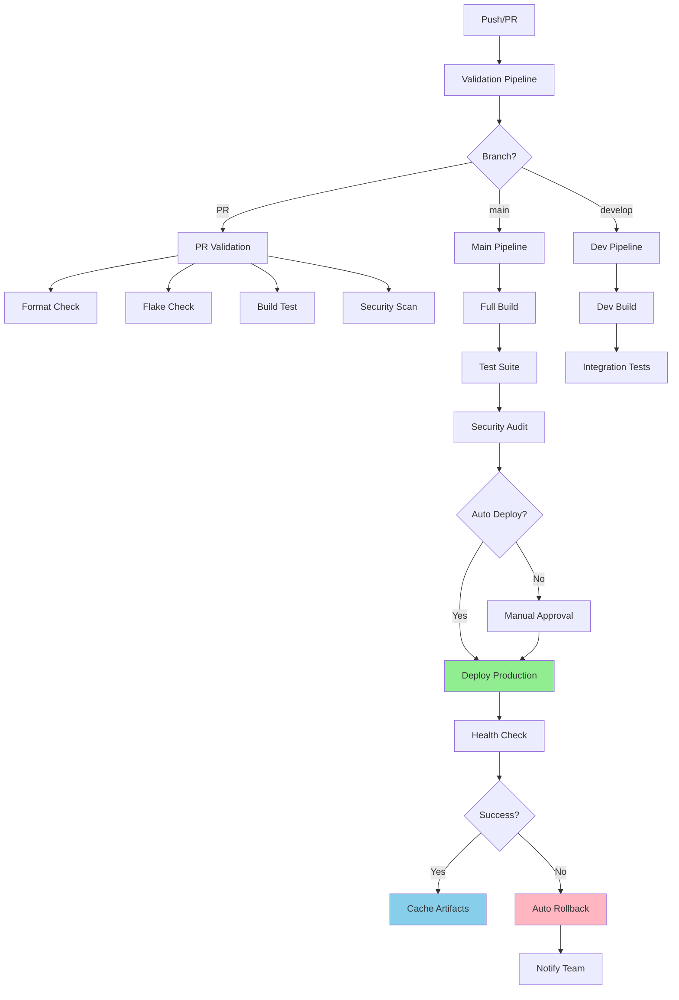

# CI/CD Architecture - GitHub Actions for NixOS

## 📋 Visão Geral

Infraestrutura profissional de CI/CD para NixOS usando GitHub Actions com templates reutilizáveis, validação automática, deploy seguro e rollback.

## 🏗️ Arquitetura



## 📁 Estrutura de Arquivos

```
.github/
├── actions/                    # Composite Actions (reutilizáveis)
│   ├── setup-nix-env/
│   │   ├── action.yml
│   │   └── README.md
│   ├── build-nixos/
│   │   ├── action.yml
│   │   └── README.md
│   ├── test-modules/
│   │   ├── action.yml
│   │   └── README.md
│   ├── deploy-safe/
│   │   ├── action.yml
│   │   └── README.md
│   └── notify/
│       ├── action.yml
│       └── README.md
│
├── workflows/                  # Workflows
│   ├── ci-main.yml            # Pipeline principal
│   ├── pr-validation.yml      # Validação de PR
│   ├── deploy-production.yml  # Deploy para produção
│   ├── rollback.yml           # Rollback automatizado
│   ├── nightly.yml            # Manutenção noturna
│   ├── setup-sops.yml         # Setup SOPS (reusable)
│   └── security-scan.yml      # Security scan (reusable)
│
└── templates/                  # Templates para outros projetos
    ├── basic-nixos.yml
    ├── flake-only.yml
    └── full-cicd.yml

scripts/
└── ci/                         # Scripts de CI/CD
    ├── build-helper.sh
    ├── deploy-helper.sh
    ├── rollback-helper.sh
    ├── health-check.sh
    └── notify.sh
```

## 🔄 Pipelines

### 1. **PR Validation Pipeline**

**Trigger**: Pull Request criado/atualizado

**Jobs**:
1. ✅ Format Check (nixfmt)
2. ✅ Flake Check (syntax validation)
3. ✅ Build Test (verificar se compila)
4. ✅ Unit Tests (módulos individuais)
5. ✅ Security Scan (vulnerabilidades)
6. ✅ Size Check (análise de closure size)

**Duração**: ~5-10 minutos  
**Cache**: Agressivo para velocidade

### 2. **Main Pipeline** (Production)

**Trigger**: Push para `main` branch

**Jobs**:
1. ✅ Validation (completa)
2. ✅ Build (todos os targets)
3. ✅ Integration Tests
4. ✅ Security Audit
5. ⚡ Deploy (automático ou manual)
6. 🔍 Health Check
7. 💾 Cache Artifacts
8. 📊 Generate Report

**Duração**: ~15-25 minutos  
**Rollback**: Automático em falha

### 3. **Development Pipeline**

**Trigger**: Push para `develop` branch

**Jobs**:
1. ✅ Quick Build
2. ✅ Integration Tests
3. 🚀 Deploy to Staging (opcional)

**Duração**: ~10-15 minutos

### 4. **Rollback Pipeline**

**Trigger**: 
- Manual (workflow_dispatch)
- Automático (falha no health check)

**Jobs**:
1. 🔍 Identify Last Good Version
2. ⏮️ Rollback System
3. ✅ Verify Rollback
4. 📧 Notify Team

**Duração**: ~3-5 minutos

### 5. **Nightly Maintenance**

**Trigger**: Schedule (cron: 0 2 * * *)

**Jobs**:
1. 🧹 Cleanup Old Artifacts
2. 📦 Update Dependencies
3. 🔒 Security Scan Completo
4. 📊 Generate Metrics Report
5. 💾 Backup Configurations

**Duração**: ~30-45 minutos

## 🎯 Composite Actions (Reutilizáveis)

### 1. **setup-nix-env**
Configura ambiente Nix com cache e otimizações

**Inputs**:
- `cachix-name`: Nome do cache Cachix
- `cachix-token`: Token de autenticação
- `enable-flakes`: Habilitar flakes (default: true)

**Outputs**:
- `nix-version`: Versão do Nix instalada

### 2. **build-nixos**
Build de configuração NixOS com validação

**Inputs**:
- `config-path`: Path da configuração
- `target`: Target de build (toplevel/iso/vm)
- `enable-tests`: Executar testes (default: true)

**Outputs**:
- `build-path`: Path do resultado
- `closure-size`: Tamanho do closure

### 3. **test-modules**
Testa módulos NixOS individuais

**Inputs**:
- `module-paths`: Lista de módulos para testar
- `test-shell`: Testar dev shells (default: true)

**Outputs**:
- `test-results`: JSON com resultados

### 4. **deploy-safe**
Deploy seguro com rollback automático

**Inputs**:
- `config-flake`: Flake da configuração
- `target-host`: Host de destino
- `health-check-timeout`: Timeout do health check

**Outputs**:
- `deployment-id`: ID do deployment
- `rollback-version`: Versão para rollback

### 5. **notify**
Notificações para Discord/Slack/Email

**Inputs**:
- `status`: success/failure/warning
- `message`: Mensagem customizada
- `webhook-url`: URL do webhook

## 🔐 Segurança

### Secrets Management

**GitHub Secrets** (configurar no repo):
```yaml
AGE_SECRET_KEY       # Chave AGE para SOPS
CACHIX_AUTH_TOKEN    # Token Cachix
DISCORD_WEBHOOK      # Webhook Discord (opcional)
SLACK_WEBHOOK        # Webhook Slack (opcional)
DEPLOY_SSH_KEY       # Chave SSH para deploy remoto (opcional)
```

### SOPS Integration

Workflow `setup-sops.yml` descriptografa secrets automaticamente:
- ✅ Cachix tokens
- ✅ GitHub PAT
- ✅ API keys
- ✅ SSH keys

### Security Scanning

Múltiplas camadas de segurança:
1. **vulnix**: Scan de vulnerabilidades conhecidas
2. **Secret scanning**: Busca secrets expostos
3. **Dependency audit**: Análise de dependências
4. **SOPS validation**: Validação de encriptação

## 📊 Monitoramento e Métricas

### Build Metrics

Coletados automaticamente:
- ⏱️ Tempo de build
- 💾 Tamanho de closure
- 🔄 Taxa de sucesso
- 📈 Histórico de builds

### Health Checks

Post-deployment:
- ✅ Systemd services status
- ✅ Journal errors check
- ✅ Disk space
- ✅ Memory usage
- ✅ Critical services

## 🎨 Templates para Reutilização

### Basic NixOS Template
```yaml
# Copiar para: .github/workflows/ci.yml
name: CI
on: [push, pull_request]
jobs:
  build:
    uses: VoidNxSEC/nixos/.github/workflows/pr-validation.yml@main
```

### Full CI/CD Template
```yaml
# Pipeline completo com deploy
name: Full CI/CD
on: 
  push:
    branches: [main]
  pull_request:

jobs:
  validate:
    if: github.event_name == 'pull_request'
    uses: ./.github/workflows/pr-validation.yml
    
  deploy:
    if: github.event_name == 'push' && github.ref == 'refs/heads/main'
    uses: ./.github/workflows/deploy-production.yml
    secrets: inherit
```

## 🚀 Quick Start

### Para usar em outro projeto:

1. **Copiar estrutura**:
   ```bash
   cp -r .github/actions/* seu-projeto/.github/actions/
   cp .github/workflows/pr-validation.yml seu-projeto/.github/workflows/
   ```

2. **Configurar secrets**:
   ```bash
   gh secret set AGE_SECRET_KEY < your-age-key.txt
   gh secret set CACHIX_AUTH_TOKEN
   ```

3. **Customizar workflows**:
   ```yaml
   # Ajustar .github/workflows/ci.yml
   env:
     CACHIX_CACHE_NAME: seu-cache
   ```

## 📝 Boas Práticas

### Commits
- ✅ Commits pequenos e frequentes
- ✅ Mensagens descritivas
- ✅ PR antes de merge para main

### Branches
- `main`: Produção (protegida)
- `develop`: Desenvolvimento
- `feature/*`: Features
- `hotfix/*`: Correções urgentes

### Deploy
- ✅ Sempre via CI/CD
- ✅ Manual approval para prod
- ✅ Rollback automático em falhas
- ✅ Health checks obrigatórios

### Cache Strategy
- ✅ Cachix para builds Nix
- ✅ GitHub Actions cache para artifacts
- ✅ Cache agressivo em PRs
- ✅ Rebuild completo nightly

## 🔧 Troubleshooting

### Build Failing
```bash
# Local: replicar o build
nix build .#nixosConfigurations.kernelcore.config.system.build.toplevel --show-trace

# Check logs
journalctl -u github-runner-* -f
```

### Deploy Failing
```bash
# Verificar health check
systemctl --failed
journalctl -p err -n 50

# Rollback manual
nixos-rebuild switch --rollback
```

### Cache Issues
```bash
# Limpar cache local
nix-collect-garbage -d

# Rebuild cache
cachix push seu-cache $(nix-build)
```

## 📚 Referências

- [GitHub Actions Documentation](https://docs.github.com/en/actions)
- [Nix Flakes](https://nixos.wiki/wiki/Flakes)
- [Cachix](https://cachix.org/)
- [SOPS](https://github.com/mozilla/sops)

---

**Mantido por**: VoidNxSEC Team  
**Última atualização**: 2025-11-28