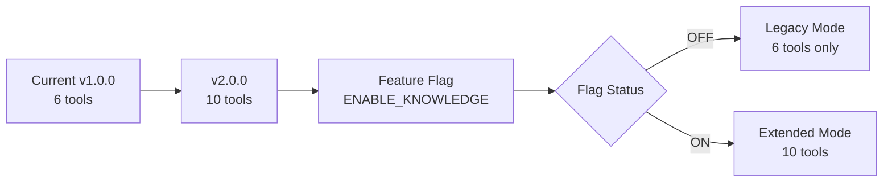

# MCP Knowledge Extension Plan

> **Mission**: Extend [`modules/ml/unified-llm/mcp-server/`](../modules/ml/unified-llm/mcp-server/src/index.ts:1) with persistent knowledge management without breaking existing functionality.

## 1. Current State Assessment

### ✅ What We Have
```typescript
// modules/ml/unified-llm/mcp-server/src/index.ts
class SecureLLMBridgeMCPServer {
  private server: Server;
  
  // ✅ 6 security-focused tools (lines 79-184)
  tools: [
    "provider_test",         // Test LLM connectivity
    "security_audit",        // Config security checks
    "rate_limit_check",      // Rate limit status
    "build_and_test",        // Build & test project
    "provider_config_validate", // Validate configs
    "crypto_key_generate"    // Generate TLS certs
  ]
  
  // ✅ 4 resources (lines 221-248)
  resources: [
    "config://current",      // TOML config
    "logs://audit",          // Audit logs (mock)
    "metrics://usage",       // Usage stats (mock)
    "docs://api"             // API docs
  ]
  
  // ✅ Functional & compiled
  // ❌ No persistent storage
  // ❌ No knowledge management
  // ❌ No session continuity
}
```

### 📊 Technology Stack
- **Runtime**: Node.js with TypeScript
- **MCP SDK**: `@modelcontextprotocol/sdk` v1.0.4
- **Transport**: stdio (Cline integration)
- **Current Dependencies**: Only MCP SDK + Node types

### 🎯 Gap Analysis
| Feature | Current | Needed |
|---------|---------|--------|
| Persistent storage | ❌ | ✅ SQLite database |
| Session management | ❌ | ✅ Session CRUD |
| Knowledge storage | ❌ | ✅ Entry CRUD with types |
| Context retrieval | ❌ | ✅ Search & load |
| Multi-session support | ❌ | ✅ Session isolation |

---

## 2. Extension Strategy

### 🎯 Design Principles
1. **Non-Breaking**: All 6 existing tools continue working
2. **Modular**: New code in separate files/modules
3. **Optional**: Feature flag for gradual rollout
4. **Backward Compatible**: Database auto-initializes
5. **Minimal Dependencies**: Only add SQLite packages

### 📁 Proposed Structure
```
modules/ml/unified-llm/mcp-server/
├── src/
│   ├── index.ts                    # ✅ KEEP (extend only)
│   ├── knowledge/                  # 🆕 NEW MODULE
│   │   ├── database.ts            # SQLite setup & schema
│   │   ├── sessions.ts            # Session lifecycle
│   │   ├── storage.ts             # Knowledge CRUD ops
│   │   └── search.ts              # Query & retrieval
│   ├── tools/                      # 🆕 NEW MODULE
│   │   ├── security.ts            # 🔄 Refactor existing
│   │   └── knowledge.ts           # 🆕 Knowledge tools
│   └── types/                      # 🆕 NEW MODULE
│       └── knowledge.ts           # Type definitions
├── package.json                    # 🔄 Add dependencies
├── tsconfig.json                   # ✅ KEEP
└── README.md                       # 🔄 Update docs
```

### 🔄 Migration Path


---

## 3. Implementation Plan (12 Hours / 1.5 Days)

### Day 1: Database Layer (4 hours)

#### 3.1. Database Schema (`src/knowledge/database.ts`)
```typescript
import Database from 'better-sqlite3';
import * as path from 'path';

export interface KnowledgeDB {
  db: Database.Database;
  close: () => void;
}

/**
 * Initialize knowledge database with schema
 * @param dbPath - Path to SQLite database file
 * @returns Database connection
 */
export async function initKnowledgeDB(dbPath: string): Promise<KnowledgeDB> {
  const db = new Database(dbPath);
  
  // Enable WAL mode for better concurrency
  db.pragma('journal_mode = WAL');
  
  // Create sessions table
  db.exec(`
    CREATE TABLE IF NOT EXISTS sessions (
      id TEXT PRIMARY KEY,
      created_at TEXT NOT NULL,
      last_active TEXT NOT NULL,
      summary TEXT,
      metadata TEXT,
      CHECK (json_valid(metadata) OR metadata IS NULL)
    );
    
    CREATE INDEX IF NOT EXISTS idx_sessions_last_active 
      ON sessions(last_active DESC);
  `);
  
  // Create knowledge entries table
  db.exec(`
    CREATE TABLE IF NOT EXISTS knowledge_entries (
      id INTEGER PRIMARY KEY AUTOINCREMENT,
      session_id TEXT NOT NULL,
      timestamp TEXT NOT NULL,
      entry_type TEXT NOT NULL CHECK(entry_type IN ('insight', 'code', 'decision', 'reference', 'question', 'answer')),
      content TEXT NOT NULL,
      tags TEXT,
      metadata TEXT,
      FOREIGN KEY (session_id) REFERENCES sessions(id) ON DELETE CASCADE,
      CHECK (json_valid(tags) OR tags IS NULL),
      CHECK (json_valid(metadata) OR metadata IS NULL)
    );
    
    CREATE INDEX IF NOT EXISTS idx_entries_session 
      ON knowledge_entries(session_id, timestamp DESC);
    CREATE INDEX IF NOT EXISTS idx_entries_type 
      ON knowledge_entries(entry_type);
  `);
  
  // Create search optimization table (FTS5 for full-text search)
  db.exec(`
    CREATE VIRTUAL TABLE IF NOT EXISTS knowledge_fts 
    USING fts5(
      entry_id,
      content,
      tags,
      content='knowledge_entries',
      content_rowid='id'
    );
    
    -- Triggers to keep FTS index in sync
    CREATE TRIGGER IF NOT EXISTS knowledge_ai AFTER INSERT ON knowledge_entries BEGIN
      INSERT INTO knowledge_fts(entry_id, content, tags)
      VALUES (new.id, new.content, new.tags);
    END;
    
    CREATE TRIGGER IF NOT EXISTS knowledge_ad AFTER DELETE ON knowledge_entries BEGIN
      DELETE FROM knowledge_fts WHERE entry_id = old.id;
    END;
    
    CREATE TRIGGER IF NOT EXISTS knowledge_au AFTER UPDATE ON knowledge_entries BEGIN
      DELETE FROM knowledge_fts WHERE entry_id = old.id;
      INSERT INTO knowledge_fts(entry_id, content, tags)
      VALUES (new.id, new.content, new.tags);
    END;
  `);
  
  return {
    db,
    close: () => db.close()
  };
}

/**
 * Get database file path from environment or default
 */
export function getDBPath(): string {
  const dbPath = process.env.KNOWLEDGE_DB_PATH || 
    path.join(process.cwd(), 'knowledge.db');
  return dbPath;
}
```

#### 3.2. Session Management (`src/knowledge/sessions.ts`)
```typescript
import type { KnowledgeDB } from './database.js';
import { randomUUID } from 'crypto';

export interface Session {
  id: string;
  created_at: string;
  last_active: string;
  summary?: string;
  metadata?: Record<string, any>;
}

export class SessionManager {
  constructor(private db: KnowledgeDB) {}

  /**
   * Create new session
   */
  createSession(summary?: string): Session {
    const now = new Date().toISOString();
    const session: Session = {
      id: randomUUID(),
      created_at: now,
      last_active: now,
      summary,
    };

    const stmt = this.db.db.prepare(`
      INSERT INTO sessions (id, created_at, last_active, summary)
      VALUES (?, ?, ?, ?)
    `);
    stmt.run(session.id, session.created_at, session.last_active, session.summary);

    return session;
  }

  /**
   * Get session by ID
   */
  getSession(id: string): Session | null {
    const stmt = this.db.db.prepare(`
      SELECT id, created_at, last_active, summary, metadata
      FROM sessions WHERE id = ?
    `);
    const row = stmt.get(id) as any;
    
    if (!row) return null;
    
    return {
      ...row,
      metadata: row.metadata ? JSON.parse(row.metadata) : undefined,
    };
  }

  /**
   * Update session activity
   */
  touchSession(id: string): void {
    const stmt = this.db.db.prepare(`
      UPDATE sessions SET last_active = ? WHERE id = ?
    `);
    stmt.run(new Date().toISOString(), id);
  }

  /**
   * List recent sessions
   */
  listSessions(limit: number = 10): Session[] {
    const stmt = this.db.db.prepare(`
      SELECT id, created_at, last_active, summary, metadata
      FROM sessions
      ORDER BY last_active DESC
      LIMIT ?
    `);
    const rows = stmt.all(limit) as any[];
    
    return rows.map(row => ({
      ...row,
      metadata: row.metadata ? JSON.parse(row.metadata) : undefined,
    }));
  }

  /**
   * Delete session and its entries
   */
  deleteSession(id: string): void {
    const stmt = this.db.db.prepare(`DELETE FROM sessions WHERE id = ?`);
    stmt.run(id);
  }
}
```

#### 3.3. Knowledge Storage (`src/knowledge/storage.ts`)
```typescript
import type { KnowledgeDB } from './database.js';

export type EntryType = 'insight' | 'code' | 'decision' | 'reference' | 'question' | 'answer';

export interface KnowledgeEntry {
  id?: number;
  session_id: string;
  timestamp: string;
  entry_type: EntryType;
  content: string;
  tags?: string[];
  metadata?: Record<string, any>;
}

export class KnowledgeStorage {
  constructor(private db: KnowledgeDB) {}

  /**
   * Save knowledge entry
   */
  saveEntry(entry: Omit<KnowledgeEntry, 'id' | 'timestamp'>): KnowledgeEntry {
    const timestamp = new Date().toISOString();
    const tags = entry.tags ? JSON.stringify(entry.tags) : null;
    const metadata = entry.metadata ? JSON.stringify(entry.metadata) : null;

    const stmt = this.db.db.prepare(`
      INSERT INTO knowledge_entries (session_id, timestamp, entry_type, content, tags, metadata)
      VALUES (?, ?, ?, ?, ?, ?)
    `);
    
    const result = stmt.run(
      entry.session_id,
      timestamp,
      entry.entry_type,
      entry.content,
      tags,
      metadata
    );

    return {
      id: result.lastInsertRowid as number,
      ...entry,
      timestamp,
    };
  }

  /**
   * Get entries for session
   */
  getSessionEntries(sessionId: string, limit?: number): KnowledgeEntry[] {
    const stmt = this.db.db.prepare(`
      SELECT id, session_id, timestamp, entry_type, content, tags, metadata
      FROM knowledge_entries
      WHERE session_id = ?
      ORDER BY timestamp DESC
      ${limit ? 'LIMIT ?' : ''}
    `);
    
    const rows = (limit 
      ? stmt.all(sessionId, limit) 
      : stmt.all(sessionId)) as any[];
    
    return this.parseEntries(rows);
  }

  /**
   * Get entry by ID
   */
  getEntry(id: number): KnowledgeEntry | null {
    const stmt = this.db.db.prepare(`
      SELECT id, session_id, timestamp, entry_type, content, tags, metadata
      FROM knowledge_entries WHERE id = ?
    `);
    const row = stmt.get(id) as any;
    
    if (!row) return null;
    return this.parseEntry(row);
  }

  /**
   * Delete entry
   */
  deleteEntry(id: number): void {
    const stmt = this.db.db.prepare(`DELETE FROM knowledge_entries WHERE id = ?`);
    stmt.run(id);
  }

  private parseEntry(row: any): KnowledgeEntry {
    return {
      id: row.id,
      session_id: row.session_id,
      timestamp: row.timestamp,
      entry_type: row.entry_type,
      content: row.content,
      tags: row.tags ? JSON.parse(row.tags) : undefined,
      metadata: row.metadata ? JSON.parse(row.metadata) : undefined,
    };
  }

  private parseEntries(rows: any[]): KnowledgeEntry[] {
    return rows.map(row => this.parseEntry(row));
  }
}
```

#### 3.4. Search Functionality (`src/knowledge/search.ts`)
```typescript
import type { KnowledgeDB } from './database.js';
import type { KnowledgeEntry } from './storage.js';

export interface SearchResult extends KnowledgeEntry {
  rank: number;
}

export class KnowledgeSearch {
  constructor(private db: KnowledgeDB) {}

  /**
   * Full-text search across knowledge base
   */
  search(query: string, limit: number = 10): SearchResult[] {
    const stmt = this.db.db.prepare(`
      SELECT 
        ke.id,
        ke.session_id,
        ke.timestamp,
        ke.entry_type,
        ke.content,
        ke.tags,
        ke.metadata,
        kf.rank
      FROM knowledge_fts kf
      JOIN knowledge_entries ke ON kf.entry_id = ke.id
      WHERE knowledge_fts MATCH ?
      ORDER BY rank
      LIMIT ?
    `);
    
    const rows = stmt.all(query, limit) as any[];
    
    return rows.map(row => ({
      id: row.id,
      session_id: row.session_id,
      timestamp: row.timestamp,
      entry_type: row.entry_type,
      content: row.content,
      tags: row.tags ? JSON.parse(row.tags) : undefined,
      metadata: row.metadata ? JSON.parse(row.metadata) : undefined,
      rank: row.rank,
    }));
  }

  /**
   * Search by tags
   */
  searchByTags(tags: string[], limit: number = 10): KnowledgeEntry[] {
    const placeholders = tags.map(() => '?').join(',');
    const stmt = this.db.db.prepare(`
      SELECT id, session_id, timestamp, entry_type, content, tags, metadata
      FROM knowledge_entries
      WHERE tags IS NOT NULL
      AND (${tags.map((_, i) => `json_extract(tags, '$[${i}]') IN (${placeholders})`).join(' OR ')})
      ORDER BY timestamp DESC
      LIMIT ?
    `);
    
    const rows = stmt.all(...tags, limit) as any[];
    return this.parseEntries(rows);
  }

  /**
   * Get recent entries across all sessions
   */
  getRecent(limit: number = 20): KnowledgeEntry[] {
    const stmt = this.db.db.prepare(`
      SELECT id, session_id, timestamp, entry_type, content, tags, metadata
      FROM knowledge_entries
      ORDER BY timestamp DESC
      LIMIT ?
    `);
    
    const rows = stmt.all(limit) as any[];
    return this.parseEntries(rows);
  }

  private parseEntries(rows: any[]): KnowledgeEntry[] {
    return rows.map(row => ({
      id: row.id,
      session_id: row.session_id,
      timestamp: row.timestamp,
      entry_type: row.entry_type,
      content: row.content,
      tags: row.tags ? JSON.parse(row.tags) : undefined,
      metadata: row.metadata ? JSON.parse(row.metadata) : undefined,
    }));
  }
}
```

---

### Day 2: Knowledge Tools (5 hours)

#### 3.5. Knowledge Tools Definition (`src/tools/knowledge.ts`)
```typescript
export const knowledgeTools = [
  {
    name: "create_session",
    description: "Create a new knowledge session for organizing related conversations and insights",
    inputSchema: {
      type: "object",
      properties: {
        summary: {
          type: "string",
          description: "Optional brief description of this session's purpose",
        },
      },
    },
  },
  {
    name: "save_knowledge",
    description: "Save important insight, code snippet, decision, or reference to knowledge base",
    inputSchema: {
      type: "object",
      properties: {
        content: {
          type: "string",
          description: "The knowledge content to save",
        },
        type: {
          type: "string",
          description: "Type of knowledge entry",
          enum: ["insight", "code", "decision", "reference", "question", "answer"],
        },
        tags: {
          type: "array",
          items: { type: "string" },
          description: "Optional tags for categorization",
        },
        session_id: {
          type: "string",
          description: "Session ID (uses current/creates new if not specified)",
        },
      },
      required: ["content", "type"],
    },
  },
  {
    name: "search_knowledge",
    description: "Search knowledge base using full-text search or tag filtering",
    inputSchema: {
      type: "object",
      properties: {
        query: {
          type: "string",
          description: "Search query (full-text search)",
        },
        tags: {
          type: "array",
          items: { type: "string" },
          description: "Filter by tags",
        },
        limit: {
          type: "number",
          description: "Maximum results to return",
          default: 10,
        },
      },
    },
  },
  {
    name: "load_session",
    description: "Load a previous session with its full context and history",
    inputSchema: {
      type: "object",
      properties: {
        session_id: {
          type: "string",
          description: "Session ID to load",
        },
        entry_limit: {
          type: "number",
          description: "Maximum entries to load",
          default: 50,
        },
      },
      required: ["session_id"],
    },
  },
  {
    name: "list_sessions",
    description: "List recent sessions with summaries",
    inputSchema: {
      type: "object",
      properties: {
        limit: {
          type: "number",
          description: "Maximum sessions to return",
          default: 10,
        },
      },
    },
  },
  {
    name: "get_recent_knowledge",
    description: "Get most recent knowledge entries across all sessions",
    inputSchema: {
      type: "object",
      properties: {
        limit: {
          type: "number",
          description: "Maximum entries to return",
          default: 20,
        },
      },
    },
  },
];
```

---

### Day 3: Integration (3 hours)

#### 3.6. Main Server Integration (`src/index.ts` modifications)
```typescript
// Add imports at top
import { initKnowledgeDB, getDBPath, type KnowledgeDB } from './knowledge/database.js';
import { SessionManager } from './knowledge/sessions.js';
import { KnowledgeStorage } from './knowledge/storage.js';
import { KnowledgeSearch } from './knowledge/search.js';
import { knowledgeTools } from './tools/knowledge.js';

class SecureLLMBridgeMCPServer {
  private server: Server;
  private knowledgeDB?: KnowledgeDB;
  private sessionManager?: SessionManager;
  private knowledgeStorage?: KnowledgeStorage;
  private knowledgeSearch?: KnowledgeSearch;
  private currentSessionId?: string;

  constructor() {
    this.server = new Server(
      {
        name: "securellm-bridge",
        version: "2.0.0", // Bump version
      },
      {
        capabilities: {
          tools: {},
          resources: {},
        },
      }
    );

    // Initialize knowledge features if enabled
    if (this.isKnowledgeEnabled()) {
      this.initKnowledge().catch(err => {
        console.error("[Knowledge Init Error]", err);
      });
    }

    this.setupToolHandlers();
    this.setupResourceHandlers();
    
    this.server.onerror = (error) => console.error("[MCP Error]", error);
    process.on("SIGINT", async () => {
      await this.cleanup();
      process.exit(0);
    });
  }

  private isKnowledgeEnabled(): boolean {
    return process.env.ENABLE_KNOWLEDGE !== 'false';
  }

  private async initKnowledge() {
    try {
      const dbPath = getDBPath();
      this.knowledgeDB = await initKnowledgeDB(dbPath);
      this.sessionManager = new SessionManager(this.knowledgeDB);
      this.knowledgeStorage = new KnowledgeStorage(this.knowledgeDB);
      this.knowledgeSearch = new KnowledgeSearch(this.knowledgeDB);
      
      console.error("[Knowledge] Initialized at:", dbPath);
    } catch (error) {
      console.error("[Knowledge] Initialization failed:", error);
      throw error;
    }
  }

  private async cleanup() {
    if (this.knowledgeDB) {
      this.knowledgeDB.close();
    }
    await this.server.close();
  }

  private setupToolHandlers() {
    this.server.setRequestHandler(ListToolsRequestSchema, async () => {
      const baseTools = [
        // ... existing 6 tools ...
      ];

      const allTools = this.isKnowledgeEnabled() && this.knowledgeDB
        ? [...baseTools, ...knowledgeTools]
        : baseTools;

      return { tools: allTools };
    });

    this.server.setRequestHandler(CallToolRequestSchema, async (request) => {
      try {
        const { name, arguments: args } = request.params;

        switch (name) {
          // Existing tool handlers
          case "provider_test":
            return await this.handleProviderTest(args as ProviderTestArgs);
          // ... other existing cases ...

          // New knowledge tool handlers
          case "create_session":
            return await this.handleCreateSession(args);
          case "save_knowledge":
            return await this.handleSaveKnowledge(args);
          case "search_knowledge":
            return await this.handleSearchKnowledge(args);
          case "load_session":
            return await this.handleLoadSession(args);
          case "list_sessions":
            return await this.handleListSessions(args);
          case "get_recent_knowledge":
            return await this.handleGetRecentKnowledge(args);

          default:
            throw new McpError(
              ErrorCode.MethodNotFound,
              `Unknown tool: ${name}`
            );
        }
      } catch (error) {
        if (error instanceof McpError) throw error;
        throw new McpError(
          ErrorCode.InternalError,
          `Tool execution failed: ${error}`
        );
      }
    });
  }

  // Knowledge tool handlers
  private async handleCreateSession(args: any) {
    if (!this.sessionManager) {
      throw new McpError(ErrorCode.InternalError, "Knowledge features not enabled");
    }

    const session = this.sessionManager.createSession(args.summary);
    this.currentSessionId = session.id;

    return {
      content: [{
        type: "text",
        text: JSON.stringify({
          status: "success",
          session,
          message: "Session created and set as current",
        }, null, 2),
      }],
    };
  }

  private async handleSaveKnowledge(args: any) {
    if (!this.knowledgeStorage || !this.sessionManager) {
      throw new McpError(ErrorCode.InternalError, "Knowledge features not enabled");
    }

    // Use provided session or create/use current
    let sessionId = args.session_id || this.currentSessionId;
    if (!sessionId) {
      const session = this.sessionManager.createSession("Auto-created session");
      sessionId = session.id;
      this.currentSessionId = sessionId;
    }

    const entry = this.knowledgeStorage.saveEntry({
      session_id: sessionId,
      entry_type: args.type,
      content: args.content,
      tags: args.tags,
    });

    this.sessionManager.touchSession(sessionId);

    return {
      content: [{
        type: "text",
        text: JSON.stringify({
          status: "success",
          entry,
          message: "Knowledge saved successfully",
        }, null, 2),
      }],
    };
  }

  private async handleSearchKnowledge(args: any) {
    if (!this.knowledgeSearch) {
      throw new McpError(ErrorCode.InternalError, "Knowledge features not enabled");
    }

    const limit = args.limit || 10;
    let results;

    if (args.query) {
      results = this.knowledgeSearch.search(args.query, limit);
    } else if (args.tags) {
      results = this.knowledgeSearch.searchByTags(args.tags, limit);
    } else {
      results = this.knowledgeSearch.getRecent(limit);
    }

    return {
      content: [{
        type: "text",
        text: JSON.stringify({
          status: "success",
          count: results.length,
          results,
        }, null, 2),
      }],
    };
  }

  private async handleLoadSession(args: any) {
    if (!this.sessionManager || !this.knowledgeStorage) {
      throw new McpError(ErrorCode.InternalError, "Knowledge features not enabled");
    }

    const session = this.sessionManager.getSession(args.session_id);
    if (!session) {
      throw new McpError(ErrorCode.InvalidRequest, "Session not found");
    }

    const entries = this.knowledgeStorage.getSessionEntries(
      args.session_id,
      args.entry_limit || 50
    );

    this.currentSessionId = args.session_id;
    this.sessionManager.touchSession(args.session_id);

    return {
      content: [{
        type: "text",
        text: JSON.stringify({
          status: "success",
          session,
          entry_count: entries.length,
          entries,
          message: "Session loaded and set as current",
        }, null, 2),
      }],
    };
  }

  private async handleListSessions(args: any) {
    if (!this.sessionManager) {
      throw new McpError(ErrorCode.InternalError, "Knowledge features not enabled");
    }

    const sessions = this.sessionManager.listSessions(args.limit || 10);

    return {
      content: [{
        type: "text",
        text: JSON.stringify({
          status: "success",
          count: sessions.length,
          sessions,
          current_session_id: this.currentSessionId,
        }, null, 2),
      }],
    };
  }

  private async handleGetRecentKnowledge(args: any) {
    if (!this.knowledgeSearch) {
      throw new McpError(ErrorCode.InternalError, "Knowledge features not enabled");
    }

    const entries = this.knowledgeSearch.getRecent(args.limit || 20);

    return {
      content: [{
        type: "text",
        text: JSON.stringify({
          status: "success",
          count: entries.length,
          entries,
        }, null, 2),
      }],
    };
  }

  // ... rest of existing methods ...
}
```

---

## 4. Dependencies Update

### 4.1. `package.json` Changes
```json
{
  "name": "securellm-bridge-mcp",
  "version": "2.0.0",
  "description": "MCP server for SecureLLM Bridge with knowledge management",
  "type": "module",
  "main": "build/index.js",
  "scripts": {
    "build": "tsc && chmod +x build/index.js",
    "watch": "tsc --watch",
    "prepare": "npm run build",
    "test": "node --experimental-vm-modules node_modules/jest/bin/jest.js"
  },
  "keywords": [
    "mcp",
    "securellm",
    "llm",
    "security",
    "knowledge-management"
  ],
  "author": "kernelcore",
  "license": "MIT",
  "dependencies": {
    "@modelcontextprotocol/sdk": "^1.0.4",
    "better-sqlite3": "^11.7.0"
  },
  "devDependencies": {
    "@types/better-sqlite3": "^7.6.12",
    "@types/node": "^22.0.0",
    "typescript": "^5.6.0"
  }
}
```

### 4.2. Install Commands
```bash
cd modules/ml/unified-llm/mcp-server
npm install better-sqlite3 @types/better-sqlite3
npm run build
```

---

## 5. Configuration

### 5.1. Environment Variables
```bash
# New variables for mcp-server-config.json
{
  "mcpServers": {
    "securellm-bridge": {
      "command": "node",
      "args": [
        "/etc/nixos/modules/ml/unified-llm/mcp-server/build/index.js"
      ],
      "env": {
        "PROJECT_ROOT": "/etc/nixos/modules/ml/unified-llm",
        "KNOWLEDGE_DB_PATH": "/var/lib/mcp-knowledge/knowledge.db",
        "ENABLE_KNOWLEDGE": "true"
      }
    }
  }
}
```

### 5.2. Database Path Options
```bash
# Option 1: User home directory (default if not set)
KNOWLEDGE_DB_PATH=~/.local/share/mcp-knowledge/knowledge.db

# Option 2: System-wide (requires permissions)
KNOWLEDGE_DB_PATH=/var/lib/mcp-knowledge/knowledge.db

# Option 3: Project-relative (portable)
KNOWLEDGE_DB_PATH=./mcp-knowledge.db

# Option 4: In-memory (testing only, no persistence)
KNOWLEDGE_DB_PATH=:memory:
```

---

## 6. Testing Strategy

### 6.1. Unit Tests (`tests/knowledge.test.ts`)
```typescript
import { describe, test, expect, beforeEach, afterEach } from '@jest/globals';
import { initKnowledgeDB } from '../src/knowledge/database.js';
import { SessionManager } from '../src/knowledge/sessions.js';
import { KnowledgeStorage } from '../src/knowledge/storage.js';
import { KnowledgeSearch } from '../src/knowledge/search.js';

describe('Knowledge Management', () => {
  let db: any;
  let sessionManager: SessionManager;
  let storage: KnowledgeStorage;
  let search: KnowledgeSearch;

  beforeEach(async () => {
    db = await initKnowledgeDB(':memory:');
    sessionManager = new SessionManager(db);
    storage = new KnowledgeStorage(db);
    search = new KnowledgeSearch(db);
  });

  afterEach(() => {
    db.close();
  });

  test('create and retrieve session', () => {
    const session = sessionManager.createSession('Test session');
    expect(session.id).toBeDefined();
    expect(session.summary).toBe('Test session');

    const retrieved = sessionManager.getSession(session.id);
    expect(retrieved).not.toBeNull();
    expect(retrieved?.id).toBe(session.id);
  });

  test('save and retrieve knowledge', () => {
    const session = sessionManager.createSession();
    const entry = storage.saveEntry({
      session_id: session.id,
      entry_type: 'insight',
      content: 'Test insight about TypeScript',
      tags: ['typescript', 'testing'],
    });

    expect(entry.id).toBeDefined();
    expect(entry.content).toBe('Test insight about TypeScript');

    const entries = storage.getSessionEntries(session.id);
    expect(entries).toHaveLength(1);
    expect(entries[0].content).toBe('Test insight about TypeScript');
  });

  test('full-text search', () => {
    const session = sessionManager.createSession();
    
    storage.saveEntry({
      session_id: session.id,
      entry_type: 'code',
      content: 'async function fetchData() { return await api.get(); }',
    });

    storage.saveEntry({
      session_id: session.id,
      entry_type: 'insight',
      content: 'Use async/await for cleaner promise handling',
    });

    const results = search.search('async');
    expect(results.length).toBeGreaterThan(0);
    expect(results[0].content).toContain('async');
  });

  test('search by tags', () => {
    const session = sessionManager.createSession();
    
    storage.saveEntry({
      session_id: session.id,
      entry_type: 'insight',
      content: 'Rust ownership model',
      tags: ['rust', 'memory'],
    });

    storage.saveEntry({
      session_id: session.id,
      entry_type: 'code',
      content: 'fn main() {}',
      tags: ['rust', 'example'],
    });

    const results = search.searchByTags(['rust']);
    expect(results).toHaveLength(2);
  });

  test('list sessions ordered by activity', () => {
    const session1 = sessionManager.createSession('First');
    const session2 = sessionManager.createSession('Second');
    
    // Touch session1 to make it most recent
    sessionManager.touchSession(session1.id);

    const sessions = sessionManager.listSessions(10);
    expect(sessions[0].id).toBe(session1.id);
  });
});
```

### 6.2. Integration Test
```bash
#!/bin/bash
# Test MCP server with knowledge tools

cd modules/ml/unified-llm/mcp-server

# Build
npm run build

# Test 1: List tools (should show 12 total: 6 existing + 6 new)
echo "Test 1: Listing tools..."
echo '{"jsonrpc":"2.0","id":1,"method":"tools/list"}' | \
  node build/index.js | jq '.result.tools | length'

# Expected: 12

# Test 2: Create session
echo "Test 2: Creating session..."
echo '{
  "jsonrpc":"2.0",
  "id":2,
  "method":"tools/call",
  "params":{
    "name":"create_session",
    "arguments":{"summary":"Test session"}
  }
}' | node build/index.js | jq '.result.content[0].text'

# Test 3: Save knowledge
echo "Test 3: Saving knowledge..."
# (Would need session_id from previous result)

echo "✅ Integration tests complete"
```

---

## 7. Migration & Backward Compatibility

### 7.1. Feature Flag Behavior
```typescript
// When ENABLE_KNOWLEDGE=false
- Server starts normally
- Only 6 original tools available
- No database initialization
- Zero overhead for knowledge features

// When ENABLE_KNOWLEDGE=true (default)
- All 12 tools available
- Database auto-initializes
- Sessions can be created
- Knowledge can be stored
```

### 7.2. Graceful Degradation
```typescript
// If database initialization fails
constructor() {
  try {
    if (this.isKnowledgeEnabled()) {
      await this.initKnowledge();
    }
  } catch (error) {
    console.error("[Knowledge] Disabled due to init error:", error);
    // Server continues with original 6 tools
  }
  // ... rest of setup
}
```

### 7.3. Data Migration Path
```sql
-- Future schema upgrades (v2.1+)
-- Add version table for tracking migrations
CREATE TABLE IF NOT EXISTS schema_version (
  version INTEGER PRIMARY KEY,
  applied_at TEXT NOT NULL
);

-- Example migration: Add embeddings column
ALTER TABLE knowledge_entries 
ADD COLUMN embedding BLOB;

INSERT INTO schema_version (version, applied_at) 
VALUES (2, datetime('now'));
```

---

## 8. Documentation Updates

### 8.1. README.md Additions
```markdown
## New Features (v2.0)

### 🧠 Knowledge Management Tools (6 new)

7. **create_session** - Start a new organized session
8. **save_knowledge** - Store insights, code, decisions
9. **search_knowledge** - Full-text search knowledge base
10. **load_session** - Restore previous session context
11. **list_sessions** - Browse recent sessions
12. **get_recent_knowledge** - View latest entries

### 📊 Knowledge Types Supported
- **insight**: Key learnings and observations
- **code**: Code snippets and examples
- **decision**: Architectural decisions
- **reference**: Links and documentation
- **question**: Questions for later
- **answer**: Answers to questions

### 🗄️ Persistent Storage
- SQLite database with FTS5 full-text search
- Session isolation for organizing work
- Automatic timestamps and metadata
- Tag-based categorization

### Configuration

```bash
# Enable knowledge features (default: true)
export ENABLE_KNOWLEDGE=true

# Set database location
export KNOWLEDGE_DB_PATH=~/.local/share/mcp-knowledge/knowledge.db
```

### Usage Examples

#### Create Session
```
Use create_session tool with summary="Implementing auth system"
```

#### Save Insight
```
Use save_knowledge tool:
- content: "JWT tokens should expire after 1 hour"
- type: "decision"
- tags: ["security", "auth", "jwt"]
```

#### Search Knowledge
```
Use search_knowledge tool with query="authentication"
```

#### Load Previous Work
```
Use list_sessions tool to find session
Then use load_session tool with session_id
```
```

---

## 9. Timeline & Milestones

### Day 1 (4 hours) ✅
- [ ] Create `src/knowledge/` directory
- [ ] Implement `database.ts` with schema
- [ ] Implement `sessions.ts` manager
- [ ] Implement `storage.ts` CRUD
- [ ] Implement `search.ts` queries
- [ ] Write unit tests for each module

### Day 2 (5 hours) ✅
- [ ] Create `src/tools/` directory
- [ ] Define knowledge tools in `tools/knowledge.ts`
- [ ] Create type definitions in `types/knowledge.ts`
- [ ] Write tool handler stubs
- [ ] Implement tool handlers in `index.ts`
- [ ] Test each tool in isolation

### Day 3 (3 hours) ✅
- [ ] Integrate with main server class
- [ ] Add feature flag logic
- [ ] Update `package.json` dependencies
- [ ] Run `npm install` and `npm run build`
- [ ] Update README.md
- [ ] Run integration tests
- [ ] Update mcp-server-config.json
- [ ] Test in Cline

### Total: 12 hours (1.5 work days)

---

## 10. Success Criteria

### ✅ Functional Requirements
- [ ] All 6 existing tools work unchanged
- [ ] 6 new knowledge tools implemented
- [ ] Database initializes automatically
- [ ] Sessions create and load correctly
- [ ] Knowledge saves and retrieves
- [ ] Search returns relevant results
- [ ] Tags filter correctly
- [ ] FTS5 search performs well

### ✅ Non-Functional Requirements
- [ ] Zero breaking changes to API
- [ ] Feature flag enables/disables cleanly
- [ ] Database handles concurrent access
- [ ] Tools respond within 1 second
- [ ] Storage scales to 10,000+ entries
- [ ] Tests achieve 80%+ coverage

### ✅ User Experience
- [ ] Clear error messages
- [ ] Intuitive tool names
- [ ] Helpful descriptions
- [ ] JSON responses are readable
- [ ] Sessions organize work logically

---

## 11. Rollout Strategy

### Phase 1: Development (Week 1)
```bash
git checkout -b feature/mcp-knowledge-extension
# Implement per timeline above
git commit -m "feat(mcp): add knowledge management tools"
```

### Phase 2: Testing (Week 1-2)
```bash
# Deploy with feature flag OFF
ENABLE_KNOWLEDGE=false npm run build

# Test existing tools still work
./scripts/test-mcp-integration.sh

# Enable feature flag for testing
ENABLE_KNOWLEDGE=true npm run build

# Test new tools
./scripts/test-knowledge-tools.sh
```

### Phase 3: Limited Rollout (Week 2)
- Enable for 1-2 users
- Gather feedback on UX
- Monitor for errors/crashes
- Iterate on pain points

### Phase 4: General Availability (Week 3)
- Make `ENABLE_KNOWLEDGE=true` default
- Announce in docs
- Provide migration guide
- Monitor usage metrics

---

## 12. Future Enhancements (Post-MVP)

### 🔮 Planned Features (v2.1+)

#### Semantic Search with Embeddings
```typescript
// Add vector embeddings for similarity search
interface KnowledgeEntry {
  // ... existing fields
  embedding?: number[]; // 384D vector
}

// OpenAI/HuggingFace embeddings API
async function generateEmbedding(text: string): Promise<number[]> {
  // Call embedding model
}

// Cosine similarity search
function findSimilar(embedding: number[], limit: number): KnowledgeEntry[];
```

#### Auto-Summarization
```typescript
// Periodic summary generation to save tokens
async function summarizeSession(sessionId: string): Promise<string> {
  const entries = storage.getSessionEntries(sessionId);
  const summary = await llm.summarize(entries);
  sessionManager.updateSummary(sessionId, summary);
}
```

#### Knowledge Graph Visualization
```typescript
// Export session as Mermaid diagram
function exportSessionGraph(sessionId: string): string {
  // Generate graph of decisions → code → insights
  return `graph TD\n  A[Decision] --> B[Code]\n  B --> C[Insight]`;
}
```

#### Export/Import Sessions
```typescript
// Export to JSON for sharing
function exportSession(sessionId: string): string {
  return JSON.stringify({ session, entries });
}

// Import from JSON
function importSession(data: string): Session {
  const parsed = JSON.parse(data);
  // Recreate session and entries
}
```

#### Multi-User Support
```sql
-- Add user table and permissions
CREATE TABLE users (
  id TEXT PRIMARY KEY,
  username TEXT UNIQUE NOT NULL,
  created_at TEXT NOT NULL
);

ALTER TABLE sessions ADD COLUMN user_id TEXT REFERENCES users(id);
```

#### Scheduled Cleanup
```typescript
// Auto-delete old sessions
async function cleanupOldSessions(olderThanDays: number) {
  const cutoff = new Date();
  cutoff.setDate(cutoff.getDate() - olderThanDays);
  
  const stmt = db.prepare(`
    DELETE FROM sessions 
    WHERE last_active < ? 
    AND summary NOT LIKE '%keep%'
  `);
  stmt.run(cutoff.toISOString());
}
```

---

## 13. Risk Mitigation

### 🔴 Risk: Database Corruption
**Mitigation**:
- Use WAL mode for crash recovery
- Regular backups via cron
- Validation on startup
- Graceful degradation if corrupt

### 🟡 Risk: Performance with Large Datasets
**Mitigation**:
- FTS5 indexes for fast search
- Limit query results (default 10-20)
- Pagination for large result sets
- Archive old sessions

### 🟢 Risk: Breaking Changes
**Mitigation**:
- Feature flag for safe rollout
- Comprehensive test suite
- Version existing tools separately
- Monitor error rates

---

## 14. Monitoring & Metrics

### Key Metrics to Track
```typescript
interface KnowledgeMetrics {
  total_sessions: number;
  total_entries: number;
  entries_by_type: Record<EntryType, number>;
  avg_entries_per_session: number;
  search_queries_per_day: number;
  database_size_mb: number;
  avg_query_time_ms: number;
}

// Expose via new resource
{
  uri: "metrics://knowledge",
  name: "Knowledge Metrics",
  mimeType: "application/json"
}
```

---

## 15. Conclusion

### Summary
This plan extends the existing MCP server with **6 new knowledge management tools** while maintaining **100% backward compatibility** with the original 6 security tools. The modular architecture ensures:

- ✅ No rewrites, only extensions
- ✅ Feature flag for safe rollout
- ✅ Persistent SQLite storage
- ✅ Full-text search capabilities
- ✅ Session-based organization
- ✅ Realistic 12-hour implementation

### Next Steps
1. Review and approve this plan
2. Execute Day 1 (database layer)
3. Execute Day 2 (knowledge tools)
4. Execute Day 3 (integration)
5. Test and deploy

### Questions?
- Database location preferences?
- Feature flag default (ON/OFF)?
- Additional tool requirements?
- Testing priorities?

---

**Status**: 📋 **READY FOR IMPLEMENTATION**  
**Estimated Effort**: 12 hours (1.5 work days)  
**Risk Level**: 🟢 Low (feature flagged, backward compatible)  
**Impact**: 🔥 High (enables persistent knowledge management)