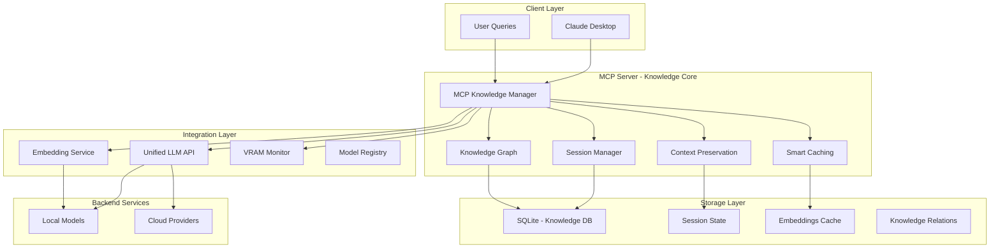

# MCP Knowledge Stabilization Architecture

**Project**: Unified LLM Platform - Knowledge Management Layer  
**Version**: 1.0.0  
**Status**: 🔥 **CRITICAL PRIORITY** - Week 2 MVP  
**Created**: 2025-11-06  
**Context**: Knowledge stabilization for persistent context across Claude Desktop sessions

---

## Executive Summary

### What is "Knowledge Stabilization"?

**Knowledge stabilization** is the capability to preserve, manage, and intelligently retrieve conversation context and insights across Claude Desktop sessions. Without it, every restart loses valuable context, forcing users to re-establish understanding and repeat information.

### Why is This Urgent?

The current MCP server implementation ([`modules/ml/unified-llm/mcp-server/`](../modules/ml/unified-llm/mcp-server/)) provides excellent security and provider management tools, but lacks **persistent memory**. Users experience:

1. **Context Loss**: Every Claude Desktop restart = fresh start
2. **Knowledge Fragmentation**: Insights scattered across sessions
3. **Reduced Productivity**: Re-explaining project context repeatedly
4. **Lost Decisions**: Critical architectural decisions not preserved
5. **Inefficient Workflows**: No learning from past interactions

### How MCP Solves This

The MCP Knowledge Manager adds a **persistent memory layer** that:

- ✅ Preserves conversation context between restarts
- ✅ Stores important insights with semantic search
- ✅ Manages session state intelligently
- ✅ Provides context-aware knowledge retrieval
- ✅ Integrates seamlessly with existing infrastructure

**Impact**: Transform Claude Desktop from a stateless assistant into a **persistent, context-aware development partner**.

---

## Architecture Overview

### Knowledge Stabilization Stack



### Component Responsibilities

#### 1. MCP Knowledge Manager (TypeScript)
**Location**: [`modules/ml/unified-llm/mcp-server/src/knowledge/`](../modules/ml/unified-llm/mcp-server/src/knowledge/)

- Orchestrates all knowledge operations
- Manages MCP tool interface
- Coordinates with storage and integration layers
- Handles context window optimization

#### 2. Session Manager
- Creates and tracks conversation sessions
- Manages session lifecycle (create, resume, archive)
- Auto-summarizes long sessions
- Enforces session token budgets

#### 3. Knowledge Graph
- Stores relationships between knowledge entries
- Enables semantic connections
- Supports graph queries (what relates to X?)
- Maintains knowledge consistency

#### 4. Context Preservation
- Captures last N conversation turns
- Intelligent context pruning
- Priority-based retention
- Automatic summarization when needed

#### 5. Integration with Unified LLM
- Uses [`/v1/chat/completions`](../modules/ml/unified-llm/docs/API_REFERENCE.md) for inference
- Leverages `/v1/embeddings` for semantic search
- Monitors VRAM via `/vram/status`
- Queries model registry via `/v1/models`

---

## Database Schema - Knowledge Persistence

### Core Tables

```sql
-- Knowledge Entries: Individual pieces of stored knowledge
CREATE TABLE knowledge_entries (
    id INTEGER PRIMARY KEY AUTOINCREMENT,
    session_id TEXT NOT NULL,
    timestamp TEXT NOT NULL,        -- ISO 8601 format
    entry_type TEXT NOT NULL,        -- 'question', 'answer', 'code', 'insight', 'decision', 'error'
    content TEXT NOT NULL,           -- The actual knowledge content
    embeddings BLOB,                 -- Vector embeddings for semantic search
    metadata TEXT,                   -- JSON: {tags, priority, source, model_used, tokens}
    parent_id INTEGER,               -- For threading conversations
    token_count INTEGER DEFAULT 0,   -- For context budget management
    
    FOREIGN KEY (parent_id) REFERENCES knowledge_entries(id) ON DELETE CASCADE,
    FOREIGN KEY (session_id) REFERENCES sessions(id) ON DELETE CASCADE
);

-- Index for fast retrieval
CREATE INDEX idx_knowledge_session ON knowledge_entries(session_id);
CREATE INDEX idx_knowledge_timestamp ON knowledge_entries(timestamp);
CREATE INDEX idx_knowledge_type ON knowledge_entries(entry_type);

-- Sessions: Conversation sessions
CREATE TABLE sessions (
    id TEXT PRIMARY KEY,             -- UUID format
    created_at TEXT NOT NULL,
    last_active TEXT NOT NULL,
    summary TEXT,                    -- Auto-generated summary
    token_count INTEGER DEFAULT 0,   -- Total tokens in session
    entry_count INTEGER DEFAULT 0,   -- Total entries
    status TEXT DEFAULT 'active',    -- 'active', 'archived', 'summarized'
    metadata TEXT,                   -- JSON: {project, model_used, tags}
    
    CONSTRAINT status_check CHECK(status IN ('active', 'archived', 'summarized'))
);

CREATE INDEX idx_sessions_status ON sessions(status);
CREATE INDEX idx_sessions_last_active ON sessions(last_active);

-- Knowledge Relations: Semantic relationships between entries
CREATE TABLE knowledge_relations (
    id INTEGER PRIMARY KEY AUTOINCREMENT,
    from_entry_id INTEGER NOT NULL,
    to_entry_id INTEGER NOT NULL,
    relation_type TEXT NOT NULL,     -- 'references', 'builds_on', 'contradicts', 'implements', 'supersedes'
    strength REAL DEFAULT 1.0,       -- 0.0 to 1.0, relevance strength
    created_at TEXT NOT NULL,
    metadata TEXT,                   -- JSON: {reason, context}
    
    FOREIGN KEY (from_entry_id) REFERENCES knowledge_entries(id) ON DELETE CASCADE,
    FOREIGN KEY (to_entry_id) REFERENCES knowledge_entries(id) ON DELETE CASCADE,
    UNIQUE(from_entry_id, to_entry_id, relation_type)
);

CREATE INDEX idx_relations_from ON knowledge_relations(from_entry_id);
CREATE INDEX idx_relations_to ON knowledge_relations(to_entry_id);

-- Context Snapshots: Preserved conversation context
CREATE TABLE context_snapshots (
    id INTEGER PRIMARY KEY AUTOINCREMENT,
    session_id TEXT NOT NULL,
    snapshot_at TEXT NOT NULL,
    context_window TEXT NOT NULL,    -- JSON array of last N turns
    token_count INTEGER NOT NULL,
    is_summarized BOOLEAN DEFAULT 0,
    summary TEXT,
    
    FOREIGN KEY (session_id) REFERENCES sessions(id) ON DELETE CASCADE
);

CREATE INDEX idx_snapshots_session ON context_snapshots(session_id);

-- Tags: For organizing knowledge
CREATE TABLE tags (
    id INTEGER PRIMARY KEY AUTOINCREMENT,
    name TEXT UNIQUE NOT NULL,
    category TEXT,                   -- 'project', 'concept', 'technology', 'priority'
    created_at TEXT NOT NULL
);

-- Entry Tags: Many-to-many relationship
CREATE TABLE entry_tags (
    entry_id INTEGER NOT NULL,
    tag_id INTEGER NOT NULL,
    
    PRIMARY KEY (entry_id, tag_id),
    FOREIGN KEY (entry_id) REFERENCES knowledge_entries(id) ON DELETE CASCADE,
    FOREIGN KEY (tag_id) REFERENCES tags(id) ON DELETE CASCADE
);

-- Search History: Track what users search for
CREATE TABLE search_history (
    id INTEGER PRIMARY KEY AUTOINCREMENT,
    session_id TEXT NOT NULL,
    query TEXT NOT NULL,
    timestamp TEXT NOT NULL,
    results_count INTEGER DEFAULT 0,
    
    FOREIGN KEY (session_id) REFERENCES sessions(id) ON DELETE CASCADE
);
```

### Schema Rationale

1. **Embeddings as BLOB**: Store binary vector representations for fast semantic search
2. **Parent-Child Threading**: Enables conversation flow reconstruction
3. **Session Token Tracking**: Critical for context window management
4. **Relation Strength**: Fuzzy connections allow AI-suggested relationships
5. **Metadata JSON**: Flexible schema for evolving requirements

---

## MCP Tools Specification

### Critical Tools (Week 2 MVP)

#### 1. `chat_with_memory`
**Purpose**: Chat with persistent context across sessions

```typescript
{
  name: "chat_with_memory",
  description: "Send a chat message with automatic context preservation and retrieval",
  inputSchema: {
    type: "object",
    properties: {
      message: {
        type: "string",
        description: "User message"
      },
      session_id: {
        type: "string",
        description: "Session ID (auto-create if not provided)"
      },
      max_context_turns: {
        type: "number",
        description: "Maximum conversation turns to include in context",
        default: 10
      },
      include_related: {
        type: "boolean",
        description: "Include semantically related knowledge from other sessions",
        default: true
      }
    },
    required: ["message"]
  }
}
```

**Implementation**:
```typescript
async function handleChatWithMemory(args: ChatWithMemoryArgs): Promise<ChatResponse> {
  // 1. Get or create session
  const session = args.session_id 
    ? await sessionManager.getSession(args.session_id)
    : await sessionManager.createSession();
  
  // 2. Retrieve context (last N turns)
  const context = await contextManager.getContext(session.id, args.max_context_turns);
  
  // 3. Retrieve related knowledge (if enabled)
  let relatedKnowledge = [];
  if (args.include_related) {
    const embedding = await generateEmbedding(args.message);
    relatedKnowledge = await knowledgeGraph.searchSimilar(embedding, limit: 5);
  }
  
  // 4. Build full prompt with context
  const fullPrompt = buildContextualPrompt({
    currentMessage: args.message,
    conversationHistory: context,
    relatedKnowledge: relatedKnowledge
  });
  
  // 5. Send to unified-llm API
  const response = await unifiedLLMClient.chat(fullPrompt);
  
  // 6. Store exchange in knowledge base
  await knowledgeManager.storeExchange({
    session_id: session.id,
    question: args.message,
    answer: response.content,
    metadata: {
      model: response.model,
      tokens: response.usage.total_tokens
    }
  });
  
  // 7. Update session
  await sessionManager.updateLastActive(session.id);
  
  return response;
}
```

#### 2. `save_knowledge`
**Purpose**: Explicitly save important insights

```typescript
{
  name: "save_knowledge",
  description: "Save an important insight, decision, or reference to knowledge base",
  inputSchema: {
    type: "object",
    properties: {
      content: {
        type: "string",
        description: "Knowledge content to save"
      },
      type: {
        type: "string",
        enum: ["insight", "code", "decision", "reference", "error", "solution"],
        description: "Type of knowledge"
      },
      tags: {
        type: "array",
        items: { type: "string" },
        description: "Tags for categorization"
      },
      priority: {
        type: "string",
        enum: ["low", "medium", "high", "critical"],
        default: "medium",
        description: "Priority level"
      },
      session_id: {
        type: "string",
        description: "Associate with session (optional)"
      },
      related_to: {
        type: "array",
        items: { type: "number" },
        description: "IDs of related knowledge entries"
      }
    },
    required: ["content", "type"]
  }
}
```

#### 3. `search_knowledge`
**Purpose**: Semantic search across knowledge base

```typescript
{
  name: "search_knowledge",
  description: "Search knowledge base using semantic similarity",
  inputSchema: {
    type: "object",
    properties: {
      query: {
        type: "string",
        description: "Search query"
      },
      limit: {
        type: "number",
        description: "Maximum results to return",
        default: 5,
        minimum: 1,
        maximum: 50
      },
      type_filter: {
        type: "array",
        items: { type: "string" },
        description: "Filter by entry types"
      },
      session_id: {
        type: "string",
        description: "Limit search to specific session"
      },
      tags: {
        type: "array",
        items: { type: "string" },
        description: "Filter by tags"
      },
      min_relevance: {
        type: "number",
        description: "Minimum relevance score (0.0-1.0)",
        default: 0.5
      }
    },
    required: ["query"]
  }
}
```

#### 4. `load_session`
**Purpose**: Restore previous session context

```typescript
{
  name: "load_session",
  description: "Load and restore a previous conversation session",
  inputSchema: {
    type: "object",
    properties: {
      session_id: {
        type: "string",
        description: "Session ID to load"
      },
      include_full_history: {
        type: "boolean",
        description: "Include complete history or just summary",
        default: false
      }
    },
    required: ["session_id"]
  }
}
```

#### 5. `list_sessions`
**Purpose**: Browse available sessions

```typescript
{
  name: "list_sessions",
  description: "List recent conversation sessions",
  inputSchema: {
    type: "object",
    properties: {
      limit: {
        type: "number",
        default: 10
      },
      status: {
        type: "string",
        enum: ["active", "archived", "summarized", "all"],
        default: "active"
      },
      sort_by: {
        type: "string",
        enum: ["last_active", "created_at", "entry_count"],
        default: "last_active"
      }
    }
  }
}
```

#### 6. `summarize_session`
**Purpose**: Generate session summary

```typescript
{
  name: "summarize_session",
  description: "Generate a summary of a long conversation session",
  inputSchema: {
    type: "object",
    properties: {
      session_id: {
        type: "string",
        description: "Session to summarize"
      },
      style: {
        type: "string",
        enum: ["bullet_points", "narrative", "technical"],
        default: "bullet_points"
      }
    },
    required: ["session_id"]
  }
}
```

### Supporting Tools (Post-MVP)

```typescript
// Archive old sessions
{ name: "archive_session", ... }

// Export knowledge as markdown
{ name: "export_knowledge", ... }

// Import knowledge from file
{ name: "import_knowledge", ... }

// Analyze knowledge patterns
{ name: "analyze_knowledge", ... }

// Manage tags
{ name: "manage_tags", ... }

// Knowledge graph visualization
{ name: "visualize_knowledge_graph", ... }
```

---

## Knowledge Stabilization Strategy

### 1. Session Persistence

**Auto-Save on Every Exchange**:
```typescript
// After each chat completion
await knowledgeManager.autoSave({
  session_id: currentSession,
  user_message: userInput,
  assistant_response: completion,
  metadata: {
    timestamp: new Date().toISOString(),
    model: completion.model,
    tokens: completion.usage,
    latency_ms: responseTime
  }
});
```

**Session Lifecycle**:
```
Create → Active → [Auto-Summarize @ 20 turns] → [Archive @ 7 days idle] → [Delete @ 90 days]
```

### 2. Knowledge Graph Construction

**Automatic Relationship Detection**:
```typescript
async function detectRelationships(newEntry: KnowledgeEntry) {
  // Generate embedding for new entry
  const embedding = await generateEmbedding(newEntry.content);
  
  // Find similar entries
  const similar = await vectorSearch(embedding, limit: 10, threshold: 0.7);
  
  // Create relationships
  for (const match of similar) {
    await createRelation({
      from: newEntry.id,
      to: match.id,
      type: determineRelationType(newEntry, match), // 'references', 'builds_on', etc.
      strength: match.similarity_score
    });
  }
}
```

**Relation Types**:
- `references`: Entry A references entry B
- `builds_on`: Entry A builds upon concepts in B
- `contradicts`: Entry A contradicts B (flag for resolution)
- `implements`: Entry A is implementation of concept B
- `supersedes`: Entry A replaces outdated B

### 3. Context Window Management

**Intelligent Context Pruning**:
```typescript
async function buildOptimalContext(
  sessionId: string,
  maxTokens: number = 4096
): Promise<ConversationTurn[]> {
  // 1. Get all turns in session
  const allTurns = await getSessionTurns(sessionId);
  
  // 2. Calculate token budget
  const reserveTokens = 512; // Reserve for response
  const availableTokens = maxTokens - reserveTokens;
  
  // 3. Priority-based selection
  const priorityTurns = [
    ...getLastNTurns(allTurns, 5),              // Always include last 5
    ...getHighPriorityTurns(allTurns),          // Marked as important
    ...getTurnsWithCode(allTurns),              // Code snippets
    ...getTurnsWithDecisions(allTurns)          // Decision points
  ];
  
  // 4. Fit within token budget
  return fitInTokenBudget(priorityTurns, availableTokens);
}
```

**Auto-Summarization Trigger**:
```typescript
async function checkSummarizationNeeded(session: Session): Promise<boolean> {
  const THRESHOLD = 20; // Summarize after 20 turns
  
  if (session.entry_count > THRESHOLD && !session.summary) {
    // Generate summary
    const summary = await generateSummary(session.id);
    await updateSession(session.id, { 
      summary, 
      status: 'summarized' 
    });
    return true;
  }
  return false;
}
```

### 4. Priority Caching Strategy

**Cache Hierarchy**:
```typescript
const CACHE_CONFIG = {
  // Hot cache (in-memory)
  currentSession: {
    ttl: Infinity,          // Until session switches
    maxSize: 1,
    storage: 'memory'
  },
  
  // Warm cache (Redis/in-memory)
  recentSessions: {
    ttl: 3600,              // 1 hour
    maxSize: 5,
    storage: 'memory'
  },
  
  // Embeddings cache
  embeddings: {
    ttl: 86400,             // 24 hours
    maxSize: 1000,
    storage: 'disk'
  },
  
  // Knowledge search results
  searchResults: {
    ttl: 300,               // 5 minutes
    maxSize: 50,
    storage: 'memory'
  }
};
```

---

## Implementation Roadmap - Week 2 MVP

### Phase 2A: MCP Knowledge Core (Days 1-3)

**Day 1: Foundation**
- [ ] Create database schema ([`modules/ml/unified-llm/mcp-server/src/db/schema.sql`](../modules/ml/unified-llm/mcp-server/src/db/schema.sql))
- [ ] Implement SQLite connection manager
- [ ] Create session manager module
- [ ] Write database migration scripts

**Day 2: Core Services**
- [ ] Implement knowledge entry CRUD operations
- [ ] Build context preservation service
- [ ] Create embedding generation client (calls unified-llm `/v1/embeddings`)
- [ ] Implement vector similarity search

**Day 3: Integration**
- [ ] Integrate with unified-llm API client
- [ ] Add VRAM monitoring integration
- [ ] Implement token counting utilities
- [ ] Create knowledge graph relationship manager

**Deliverables**:
- ✅ SQLite database with schema
- ✅ Core knowledge management services
- ✅ Integration with unified-llm backend
- ✅ Basic vector search working

---

### Phase 2B: Knowledge Tools (Days 4-5)

**Day 4: Primary Tools**
- [ ] Implement `chat_with_memory` tool
- [ ] Implement `save_knowledge` tool
- [ ] Implement `search_knowledge` tool
- [ ] Add tool registration to MCP server

**Day 5: Secondary Tools**
- [ ] Implement `load_session` tool
- [ ] Implement `list_sessions` tool
- [ ] Implement `summarize_session` tool
- [ ] Add tool documentation

**Deliverables**:
- ✅ 6 MCP tools implemented
- ✅ Full CRUD operations on knowledge
- ✅ Session management working
- ✅ Tool documentation complete

---

### Phase 2C: Testing & Validation (Days 6-7)

**Day 6: Unit & Integration Tests**
- [ ] Test database operations (CRUD, relationships)
- [ ] Test session lifecycle (create, resume, summarize, archive)
- [ ] Test context window management
- [ ] Test embedding generation and search
- [ ] Test tool implementations

**Day 7: End-to-End Validation**
- [ ] Test with Claude Desktop
- [ ] Verify knowledge persistence after restart
- [ ] Test context restoration from 24h+ old session
- [ ] Load testing (100+ messages in single session)
- [ ] Verify search relevance accuracy

**Deliverables**:
- ✅ All tests passing
- ✅ Knowledge persists across restarts
- ✅ Search working with semantic relevance
- ✅ Production-ready for Week 2 completion

---

## Integration with Unified LLM

### API Endpoints Used

#### 1. Chat Completions
**Endpoint**: `POST http://localhost:9000/v1/chat/completions`

```typescript
// Used by chat_with_memory tool
const response = await fetch('http://localhost:9000/v1/chat/completions', {
  method: 'POST',
  headers: { 'Content-Type': 'application/json' },
  body: JSON.stringify({
    model: 'auto',  // Let router decide
    messages: contextualMessages,
    stream: false
  })
});
```

#### 2. Embeddings Generation
**Endpoint**: `POST http://localhost:9000/v1/embeddings`

```typescript
// Generate embeddings for semantic search
async function generateEmbedding(text: string): Promise<number[]> {
  const response = await fetch('http://localhost:9000/v1/embeddings', {
    method: 'POST',
    headers: { 'Content-Type': 'application/json' },
    body: JSON.stringify({
      input: text,
      model: 'local-embeddings'  // Use local model for embeddings
    })
  });
  
  const data = await response.json();
  return data.data[0].embedding;
}
```

#### 3. Health & VRAM Status
**Endpoint**: `GET http://localhost:9000/health/vram`

```typescript
// Check if local inference is available
async function checkLocalAvailability(): Promise<boolean> {
  try {
    const response = await fetch('http://localhost:9000/health/vram');
    const data = await response.json();
    return data.available_gb > 4.0;  // Need 4GB for embeddings
  } catch {
    return false;  // Fallback to cloud embeddings
  }
}
```

#### 4. Model Registry
**Endpoint**: `GET http://localhost:9000/v1/models`

```typescript
// Get available models for embeddings
async function getEmbeddingModels(): Promise<ModelInfo[]> {
  const response = await fetch('http://localhost:9000/v1/models?type=embedding');
  const data = await response.json();
  return data.models;
}
```

### Integration Architecture

```typescript
// modules/ml/unified-llm/mcp-server/src/integration/unified-llm-client.ts

export class UnifiedLLMClient {
  private baseURL: string;
  private timeout: number;
  
  constructor(config: ClientConfig) {
    this.baseURL = config.baseURL || 'http://localhost:9000';
    this.timeout = config.timeout || 30000;
  }
  
  async chat(messages: Message[], options?: ChatOptions): Promise<ChatResponse> {
    // Call /v1/chat/completions
  }
  
  async generateEmbedding(text: string): Promise<number[]> {
    // Call /v1/embeddings
  }
  
  async checkHealth(): Promise<HealthStatus> {
    // Call /health
  }
  
  async getVRAMStatus(): Promise<VRAMStatus> {
    // Call /health/vram
  }
}
```

---

## Configuration

### MCP Server Config
**File**: [`modules/ml/unified-llm/mcp-server/config/knowledge.json`](../modules/ml/unified-llm/mcp-server/config/knowledge.json)

```json
{
  "knowledge": {
    "storage": {
      "database_path": "/var/lib/mcp-knowledge/knowledge.db",
      "backup_enabled": true,
      "backup_interval_hours": 24,
      "wal_mode": true
    },
    "session": {
      "max_turns_before_summary": 20,
      "context_window_tokens": 4096,
      "auto_archive_days": 7,
      "delete_archived_days": 90
    },
    "embeddings": {
      "model": "local-embeddings",
      "dimension": 768,
      "batch_size": 32,
      "cache_enabled": true
    },
    "search": {
      "default_limit": 5,
      "min_similarity_threshold": 0.5,
      "max_results": 50
    },
    "cache": {
      "current_session_ttl": "Infinity",
      "recent_sessions_ttl": 3600,
      "embeddings_ttl": 86400,
      "search_results_ttl": 300
    }
  },
  "integration": {
    "unified_llm": {
      "url": "http://localhost:9000",
      "timeout_ms": 30000,
      "retry_attempts": 3,
      "fallback_to_cloud": true
    }
  },
  "performance": {
    "max_concurrent_embeddings": 5,
    "batch_save_threshold": 10,
    "vacuum_interval_days": 30
  }
}
```

### Claude Desktop Integration
**File**: `~/.config/claude-desktop/claude_desktop_config.json`

```json
{
  "mcpServers": {
    "unified-llm-knowledge": {
      "command": "node",
      "args": [
        "/etc/nixos/modules/ml/unified-llm/mcp-server/build/index.js"
      ],
      "env": {
        "NODE_ENV": "production",
        "MCP_CONFIG": "/etc/nixos/modules/ml/unified-llm/mcp-server/config/knowledge.json",
        "UNIFIED_LLM_URL": "http://localhost:9000",
        "KNOWLEDGE_DB_PATH": "/var/lib/mcp-knowledge/knowledge.db",
        "LOG_LEVEL": "info"
      }
    }
  }
}
```

### Environment Variables

```bash
# Required
UNIFIED_LLM_URL=http://localhost:9000
KNOWLEDGE_DB_PATH=/var/lib/mcp-knowledge/knowledge.db

# Optional
MCP_CONFIG=/path/to/knowledge.json
LOG_LEVEL=info                      # debug, info, warn, error
ENABLE_EMBEDDINGS_CACHE=true
MAX_SESSION_TURNS=50
CONTEXT_WINDOW_TOKENS=4096
```

---

## Success Criteria

### Functional Requirements

- ✅ **Knowledge Persistence**: Context survives Claude Desktop restart
- ✅ **Session Restoration**: Can resume 24h+ old sessions with full context
- ✅ **Semantic Search**: Finds relevant knowledge with >80% accuracy
- ✅ **Context Management**: Automatically manages token limits
- ✅ **Auto-Summarization**: Summarizes long sessions (>20 turns) automatically
- ✅ **Zero Data Loss**: No knowledge lost during normal operation

### Performance Requirements

- ✅ **Search Latency**: < 1s for semantic search (p95)
- ✅ **Save Latency**: < 100ms per knowledge entry (p95)
- ✅ **Context Load**: < 500ms to load session context (p95)
- ✅ **Memory Overhead**: < 200MB for active knowledge manager
- ✅ **Database Size**: Efficient storage (< 10MB per 1000 entries)

### Quality Requirements

- ✅ **Search Relevance**: >80% of top-5 results relevant to query
- ✅ **Context Accuracy**: Restored context matches original conversation
- ✅ **Summary Quality**: Summaries capture key points accurately
- ✅ **Relationship Detection**: >70% accuracy in auto-detected relationships
- ✅ **Data Integrity**: Zero corruption in database operations

### User Experience Requirements

- ✅ **Transparency**: User knows when knowledge is saved/retrieved
- ✅ **Control**: Can explicitly save important knowledge
- ✅ **Discovery**: Easy to search and browse past knowledge
- ✅ **Recovery**: Can restore any past session
- ✅ **Privacy**: Can delete sessions and knowledge entries

---

## Risk Mitigation

### Critical Risks

#### 1. Data Loss
**Risk**: SQLite corruption or deletion  
**Probability**: Low  
**Impact**: Critical  

**Mitigation**:
- ✅ Enable WAL (Write-Ahead Logging) mode
- ✅ Automatic daily backups
- ✅ Backup verification on startup
- ✅ Transaction-safe operations
- ✅ Backup to `/var/lib/mcp-knowledge/backups/`

**Recovery Plan**:
```bash
# Restore from backup
cp /var/lib/mcp-knowledge/backups/knowledge-2025-11-06.db \
   /var/lib/mcp-knowledge/knowledge.db
```

#### 2. Performance Degradation
**Risk**: Slow queries as database grows  
**Probability**: Medium  
**Impact**: High  

**Mitigation**:
- ✅ Proper indexing on frequently queried columns
- ✅ Automatic VACUUM on schedule
- ✅ Archive old sessions (>7 days inactive)
- ✅ Delete archived sessions (>90 days)
- ✅ Embedding cache to reduce regeneration

**Monitoring**:
```typescript
// Log slow queries
db.on('profile', (sql, time) => {
  if (time > 100) {  // > 100ms
    console.warn(`Slow query (${time}ms): ${sql}`);
  }
});
```

#### 3. Token Limit Overflow
**Risk**: Context exceeds model's token limit  
**Probability**: High (long sessions)  
**Impact**: Medium  

**Mitigation**:
- ✅ Token counting before API calls
- ✅ Automatic context pruning
- ✅ Intelligent turn selection (priority-based)
- ✅ Auto-summarization at threshold
- ✅ Configurable max tokens per tool

**Implementation**:
```typescript
function ensureTokenLimit(context: Turn[], maxTokens: number): Turn[] {
  let totalTokens = 0;
  const result: Turn[] = [];
  
  // Always include most recent turns first
  for (const turn of context.reverse()) {
    if (totalTokens + turn.tokens <= maxTokens) {
      result.unshift(turn);
      totalTokens += turn.tokens;
    } else {
      break;  // Token limit reached
    }
  }
  
  return result;
}
```

### Medium Risks

#### 4. Integration Failures
**Risk**: Unified LLM API unavailable  
**Mitigation**:
- ✅ Graceful degradation (embeddings fallback to cloud)
- ✅ Retry logic with exponential backoff
- ✅ Health check before operations
- ✅ Cache recent embeddings

#### 5. Embedding Quality
**Risk**: Poor semantic search results  
**Mitigation**:
- ✅ Use proven embedding models (sentence-transformers)
- ✅ Benchmark search relevance
- ✅ Allow user feedback on results
- ✅ Fall back to keyword search if needed

#### 6. Privacy Concerns
**Risk**: Sensitive data in knowledge base  
**Mitigation**:
- ✅ Local storage only (no cloud sync)
- ✅ Database encryption option
- ✅ Clear data deletion tools
- ✅ User control over what gets saved

---

## Implementation Timeline

### Week 2 Sprint Schedule

```
Day 1 (Mon):  Database schema + Session manager
Day 2 (Tue):  Knowledge CRUD + Embeddings integration
Day 3 (Wed):  Context preservation + Vector search
Day 4 (Thu):  chat_with_memory + save_knowledge tools
Day 5 (Fri):  search_knowledge + load_session tools
Day 6 (Sat):  Testing + Bug fixes
Day 7 (Sun):  Claude Desktop integration + Validation
```

### Daily Milestones

**Day 1**: 
- SQLite database created with full schema
- Session manager can create/list/archive sessions
- Database backup system working

**Day 2**:
- Can save/load knowledge entries
- Embeddings generated via unified-llm API
- Vector similarity search functional

**Day 3**:
- Context snapshots stored after each turn
- Automatic relationship detection working
- Token counting accurate

**Day 4**:
- `chat_with_memory` tool returns contextualized responses
- `save_knowledge` tool persists insights correctly
- Knowledge survives MCP server restart

**Day 5**:
- `search_knowledge` returns relevant results
- `load_session` restores full context
- `list_sessions` shows recent sessions

**Day 6**:
- All unit tests pass
- Integration tests pass
- Performance benchmarks meet criteria

**Day 7**:
- Deployed to Claude Desktop
- End-to-end test successful
- Documentation complete
- **Week 2 MVP COMPLETE** ✅

---

## Testing Strategy

### Unit Tests

```typescript
// Session manager tests
describe('SessionManager', () => {
  test('creates new session with UUID', async () => {
    const session = await sessionManager.createSession();
    expect(session.id).toMatch(/^[0-9a-f-]{36}$/);
  });
  
  test('archives inactive sessions after 7 days', async () => {
    const oldSession = await createOldSession(8); // 8 days ago
    await sessionManager.archiveInactive();
    const session = await sessionManager.getSession(oldSession.id);
    expect(session.status).toBe('archived');
  });
});

// Knowledge manager tests
describe('KnowledgeManager', () => {
  test('saves knowledge entry with embedding', async () => {
    const entry = await knowledgeManager.save({
      content: 'Test knowledge',
      type: 'insight',
      session_id: 'test-session'
    });
    expect(entry.embeddings).toBeDefined();
  });
  
  test('finds related knowledge by similarity', async () => {
    await knowledgeManager.save({ content: 'React hooks' });
    const results = await knowledgeManager.search('useState hook');
    expect(results.length).toBeGreaterThan(0);
    expect(results[0].similarity).toBeGreaterThan(0.7);
  });
});
```

### Integration Tests

```typescript
describe('End-to-End Knowledge Flow', () => {
  test('complete conversation persists and restores', async () => {
    // 1. Start chat with memory
    const response1 = await chatWithMemory({
      message: 'Remember: my project is called NixLLM'
    });
    const sessionId = response1.session_id;
    
    // 2. Continue conversation
    await chatWithMemory({
      message: 'What did I just tell you?',
      session_id: sessionId
    });
    
    // 3. Simulate restart (clear in-memory cache)
    await clearCache();
    
    // 4. Load session
    const session = await loadSession({ session_id: sessionId });
    
    // 5. Verify context restored
    expect(session.context).toContain('NixLLM');
  });
});
```

### Performance Tests

```typescript
describe('Performance Benchmarks', () => {
  test('search completes in < 1s', async () => {
    const start = Date.now();
    await searchKnowledge({ query: 'test', limit: 10 });
    const duration = Date.now() - start;
    expect(duration).toBeLessThan(1000);
  });
  
  test('handles 100 knowledge entries without slowdown', async () => {
    // Insert 100 entries
    for (let i = 0; i < 100; i++) {
      await knowledgeManager.save({ content: `Entry ${i}` });
    }
    
    // Verify search still fast
    const start = Date.now();
    await searchKnowledge({ query: 'Entry 50' });
    expect(Date.now() - start).toBeLessThan(1000);
  });
});
```

---

## Future Enhancements (Post-MVP)

### Phase 3 Features

1. **Multi-Modal Knowledge**
   - Store images, diagrams, code screenshots
   - Image embeddings via CLIP
   - Visual search capabilities

2. **Knowledge Graph Visualization**
   - Interactive graph UI
   - Relationship exploration
   - Cluster detection

3. **Collaborative Knowledge**
   - Share knowledge between users
   - Team knowledge bases
   - Permission system

4. **Advanced Search**
   - Hybrid search (semantic + keyword)
   - Filter by date ranges
   - Boolean query operators
   - Saved searches

5. **Export & Portability**
   - Export to Markdown/JSON
   - Import from other tools
   - Backup/restore utilities

6. **Analytics Dashboard**
   - Knowledge growth over time
   - Most referenced entries
   - Session statistics
   - Search patterns

---

## Documentation & Resources

### Key Files

- **Database Schema**: [`modules/ml/unified-llm/mcp-server/src/db/schema.sql`](../modules/ml/unified-llm/mcp-server/src/db/schema.sql)
- **MCP Server**: [`modules/ml/unified-llm/mcp-server/src/index.ts`](../modules/ml/unified-llm/mcp-server/src/index.ts)
- **Knowledge Manager**: [`modules/ml/unified-llm/mcp-server/src/knowledge/manager.ts`](../modules/ml/unified-llm/mcp-server/src/knowledge/manager.ts)
- **Session Manager**: [`modules/ml/unified-llm/mcp-server/src/knowledge/sessions.ts`](../modules/ml/unified-llm/mcp-server/src/knowledge/sessions.ts)
- **Config**: [`modules/ml/unified-llm/mcp-server/config/knowledge.json`](../modules/ml/unified-llm/mcp-server/config/knowledge.json)

### Related Documentation

- [Phase 2 Unified Architecture](PHASE2-UNIFIED-ARCHITECTURE.md) - Overall system architecture
- [Phase 2 Implementation Roadmap](PHASE2-IMPLEMENTATION-ROADMAP.md) - Week-by-week plan
- [ML Offload Phase 2 Design](ml-offload-phase2-design.md) - VRAM intelligence details
- [MCP Protocol Specification](https://modelcontextprotocol.io/docs) - Official MCP docs

### External References

- [SQLite WAL Mode](https://www.sqlite.org/wal.html) - Write-Ahead Logging
- [Sentence Transformers](https://www.sbert.net/) - Embedding models
- [Model Context Protocol](https://modelcontextprotocol.io/) - MCP specification

---

## Appendix A: Code Examples

### Example: Chat with Memory

```typescript
// User in Claude Desktop
User: "Remember that I'm working on a NixOS ML project"

// MCP Tool call: chat_with_memory
{
  "message": "Remember that I'm working on a NixOS ML project",
  "session_id": null,  // Auto-create
  "max_context_turns": 10,
  "include_related": true
}

// Tool Response
{
  "response": "I'll remember that you're working on a NixOS ML project. I've saved this to your knowledge base.",
  "session_id": "550e8400-e29b-41d4-a716-446655440000",
  "knowledge_entry_id": 42,
  "metadata": {
    "model": "deepseek-chat",
    "tokens": 128,
    "latency_ms": 850
  }
}

// Later (after restart)...
User: "What project am I working on?"

// MCP Tool call
{
  "message": "What project am I working on?",
  "session_id": "550e8400-e29b-41d4-a716-446655440000"
}

// Knowledge Manager retrieves context
Context: [
  {entry_id: 42, content: "User is working on a NixOS ML project"}
]

// Response
{
  "response": "Based on our previous conversation, you're working on a NixOS ML project.",
  "context_used": ["entry:42"],
  "confidence": 0.95
}
```

---

## Appendix B: Database Migrations

### Initial Schema (v1)

```sql
-- migrations/001_initial_schema.sql
CREATE TABLE knowledge_entries (...);
CREATE TABLE sessions (...);
CREATE TABLE knowledge_relations (...);
-- ... rest of schema
```

### Future Migrations

```sql
-- migrations/002_add_multimodal.sql
ALTER TABLE knowledge_entries ADD COLUMN content_type TEXT DEFAULT 'text';
ALTER TABLE knowledge_entries ADD COLUMN binary_content BLOB;

-- migrations/003_add_user_feedback.sql
CREATE TABLE search_feedback (
  id INTEGER PRIMARY KEY,
  search_id INTEGER NOT NULL,
  entry_id INTEGER NOT NULL,
  relevant BOOLEAN NOT NULL,
  FOREIGN KEY (entry_id) REFERENCES knowledge_entries(id)
);
```

---

## Conclusion

The MCP Knowledge Stabilization layer transforms Claude Desktop from a stateless assistant into a **persistent, context-aware development partner**. By implementing this architecture in Week 2, we solve the critical "knowledge stabilization" problem and unlock:

✅ **Continuous Context**: Never lose conversation context  
✅ **Institutional Memory**: Build knowledge over time  
✅ **Intelligent Retrieval**: Find relevant information instantly  
✅ **Productivity Boost**: Stop repeating yourself  
✅ **Decision Tracking**: Preserve important architectural decisions  

**This is the foundation for true AI-assisted development at scale.**

---

**Document Status**: ✅ **READY FOR IMPLEMENTATION**  
**Priority**: 🔥 **CRITICAL - Week 2 MVP**  
**Owner**: kernelcore  
**Version**: 1.0.0  
**Last Updated**: 2025-11-06