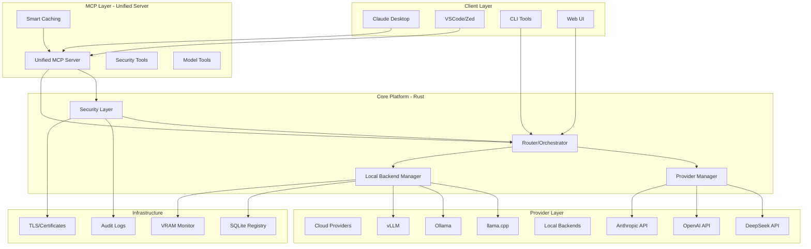

# Phase 2: Unified ML Infrastructure - Architecture & Integration Plan

**Project**: Unified LLM Orchestration & Security Platform  
**Version**: 2.0.0-alpha  
**Created**: 2025-11-06  
**Status**: 🚧 Design & Planning Phase  
**Objective**: Merge Security-Architect, mlx-mcp, and ML Offload API into cohesive enterprise platform

---

## Executive Summary

### Vision

Create a **unified, enterprise-grade platform** that combines:

1. **Secure LLM Access** (from Security-Architect)
   - Enterprise security features (TLS, audit, rate limiting)
   - Unified API for cloud providers (DeepSeek, OpenAI, Anthropic, Ollama)
   - Production-ready Rust implementation

2. **Intelligent Local Model Orchestration** (from ML Offload API)
   - VRAM-aware model loading/unloading
   - Dynamic parameter optimization
   - Backend management (llama.cpp, Ollama, vLLM, TGI)

3. **Unified IDE Integration** (from mlx-mcp + Security-Architect MCP)
   - Single MCP server exposing all capabilities
   - Claude Desktop, VSCode, Zed Editor support
   - Smart caching and token economy

### Key Benefits

- **Seamless Fallback**: Cloud provider failure → automatic local model fallback
- **Cost Optimization**: Route queries to most cost-effective provider (local when possible)
- **Security First**: All traffic (cloud + local) goes through security layer
- **Unified Interface**: Single API, single MCP server, single config
- **Enterprise Ready**: Audit logging, rate limiting, TLS, multi-tenant support

---

## Current State Analysis

### Project 1: Security-Architect (`/home/kernelcore/Downloads/ClaudeSkills/Security-Architect`)

**Language**: Rust  
**Architecture**: Cargo workspace (5 crates)  
**Status**: ✅ Core functional with DeepSeek provider

#### Strengths
- Robust security architecture (TLS, rate limiting, audit)
- Well-defined trait system (`LLMProvider`)
- Production-ready error handling
- NixOS integration (flake.nix)
- Docker deployment ready
- MCP server (TypeScript)

#### Crates
```
crates/
├── core/       - Foundation traits & types
├── security/   - TLS, crypto, audit, sandboxing
├── providers/  - DeepSeek ✅, OpenAI, Anthropic, Ollama
├── cli/        - Command-line interface
└── desktop/    - GUI (WIP)
```

#### Key Files
- [`Cargo.toml`](../../home/kernelcore/Downloads/ClaudeSkills/Security-Architect/Cargo.toml) - Workspace config
- [`CLAUDE.md`](../../home/kernelcore/Downloads/ClaudeSkills/Security-Architect/CLAUDE.md) - Comprehensive docs
- [`mcp-server/`](../../home/kernelcore/Downloads/ClaudeSkills/Security-Architect/mcp-server/) - TypeScript MCP server

---

### Project 2: mlx-mcp (`/home/kernelcore/dev/mlx-mcp`)

**Language**: TypeScript  
**Architecture**: Standalone MCP server  
**Status**: ✅ Functional, integrates with ML Offload API

#### Strengths
- Smart caching (5min models, 10s VRAM)
- Token economy (80-90% savings)
- Auto-summarization
- Rate limiting
- Clean MCP tool definitions

#### Available Tools
- `list_models` - Registry access with filters
- `get_model_info` - Detailed model data
- `load_model` - Load with params (gpu_layers, context_length)
- `unload_model` - Free VRAM
- `switch_model` - Hot-swap models
- `get_vram_status` - Real-time GPU monitoring
- `trigger_model_scan` - Update registry

#### Key Files
- [`package.json`](../../home/kernelcore/dev/mlx-mcp/package.json) - Dependencies
- [`src/index.ts`](../../home/kernelcore/dev/mlx-mcp/src/index.ts) - Main MCP server
- [`src/cache.ts`](../../home/kernelcore/dev/mlx-mcp/src/cache.ts) - Caching logic
- [`src/summarizer.ts`](../../home/kernelcore/dev/mlx-mcp/src/summarizer.ts) - Token optimization

---

### Project 3: ML Offload API (`/etc/nixos/modules/ml/offload`)

**Language**: Rust (Axum framework)  
**Architecture**: REST API + WebSocket  
**Status**: ✅ Phase 1 complete, Phase 2 designed

#### Strengths
- VRAM intelligence (nvidia-smi integration)
- SQLite model registry
- Backend abstraction layer
- WebSocket for real-time updates
- Auto-scaling based on VRAM threshold
- NixOS module integration

#### Key Components
- [`api/Cargo.toml`](modules/ml/offload/api/Cargo.toml) - Dependencies
- [`api/src/main.rs`](modules/ml/offload/api/src/main.rs) - REST API server
- [`api/src/backends/`](modules/ml/offload/api/src/backends/) - Backend drivers
- [`api/src/health.rs`](modules/ml/offload/api/src/health.rs) - Health checks
- Phase 2 design: [`docs/ml-offload-phase2-design.md`](ml-offload-phase2-design.md)

---

## Unified Architecture Design

### Component Hierarchy



---

## Directory Structure (Merged Project)

```
/etc/nixos/modules/ml/unified-llm/
├── Cargo.toml                      # Workspace root
├── flake.nix                       # NixOS integration
├── README.md                       # Project overview
├── ARCHITECTURE.md                 # This document
│
├── crates/
│   ├── core/                       # From Security-Architect
│   │   ├── src/
│   │   │   ├── lib.rs
│   │   │   ├── request.rs          # Unified request types
│   │   │   ├── response.rs         # Unified response types
│   │   │   ├── error.rs            # Error handling
│   │   │   └── traits.rs           # Provider traits
│   │   └── Cargo.toml
│   │
│   ├── security/                   # From Security-Architect
│   │   ├── src/
│   │   │   ├── lib.rs
│   │   │   ├── tls.rs              # TLS mutual auth
│   │   │   ├── rate_limit.rs       # Token bucket
│   │   │   ├── audit.rs            # Structured logging
│   │   │   ├── crypto.rs           # AES-256-GCM
│   │   │   └── sanitizer.rs        # Input sanitization
│   │   └── Cargo.toml
│   │
│   ├── providers/                  # Cloud providers
│   │   ├── src/
│   │   │   ├── lib.rs
│   │   │   ├── deepseek.rs         # ✅ Functional
│   │   │   ├── openai.rs           # To implement
│   │   │   ├── anthropic.rs        # To implement
│   │   │   └── router.rs           # NEW: Intelligent routing
│   │   └── Cargo.toml
│   │
│   ├── local/                      # NEW: Local model management
│   │   ├── src/
│   │   │   ├── lib.rs
│   │   │   ├── orchestrator.rs     # Model loading/unloading
│   │   │   ├── vram.rs             # VRAM intelligence
│   │   │   ├── registry.rs         # SQLite model registry
│   │   │   ├── backends/
│   │   │   │   ├── llamacpp.rs     # From ML Offload
│   │   │   │   ├── ollama.rs       # From ML Offload
│   │   │   │   ├── vllm.rs         # To implement
│   │   │   │   └── tgi.rs          # To implement
│   │   │   └── auto_scaling.rs     # VRAM-based auto-scaling
│   │   └── Cargo.toml
│   │
│   ├── router/                     # NEW: Intelligent request router
│   │   ├── src/
│   │   │   ├── lib.rs
│   │   │   ├── strategy.rs         # Routing strategies
│   │   │   ├── fallback.rs         # Cloud → Local fallback
│   │   │   ├── cost.rs             # Cost optimization
│   │   │   └── health.rs           # Provider health checks
│   │   └── Cargo.toml
│   │
│   ├── api/                        # REST API server
│   │   ├── src/
│   │   │   ├── main.rs             # Axum server
│   │   │   ├── routes/
│   │   │   │   ├── inference.rs    # Chat/completions
│   │   │   │   ├── models.rs       # Model management
│   │   │   │   ├── health.rs       # Health checks
│   │   │   │   └── admin.rs        # Admin operations
│   │   │   └── websocket.rs        # Real-time updates
│   │   └── Cargo.toml
│   │
│   └── cli/                        # Command-line interface
│       ├── src/
│       │   ├── main.rs
│       │   ├── commands/
│       │   │   ├── chat.rs         # Interactive chat
│       │   │   ├── models.rs       # Model operations
│       │   │   ├── config.rs       # Configuration
│       │   │   └── security.rs     # Security operations
│       │   └── Cargo.toml
│
├── mcp-server/                     # Unified MCP server (TypeScript)
│   ├── package.json
│   ├── tsconfig.json
│   ├── src/
│   │   ├── index.ts                # Main server
│   │   ├── tools/
│   │   │   ├── security.ts         # Security operations
│   │   │   ├── inference.ts        # Chat/completions
│   │   │   ├── models.ts           # Model management
│   │   │   └── monitoring.ts       # VRAM/health
│   │   ├── cache.ts                # Smart caching (from mlx-mcp)
│   │   ├── summarizer.ts           # Token optimization
│   │   └── client.ts               # API client
│   └── build/
│
├── config/
│   ├── config.toml.example         # Configuration template
│   ├── security.toml.example       # Security settings
│   └── providers.toml.example      # Provider configs
│
├── docs/
│   ├── README.md                   # Documentation index
│   ├── GETTING_STARTED.md          # Quick start guide
│   ├── ARCHITECTURE.md             # This document
│   ├── SECURITY.md                 # Security best practices
│   ├── API_REFERENCE.md            # REST API docs
│   ├── MCP_TOOLS.md                # MCP tools reference
│   └── DEPLOYMENT.md               # Deployment guide
│
├── scripts/
│   ├── setup.sh                    # Initial setup
│   ├── migrate.sh                  # Migration from old systems
│   └── test-providers.sh           # Provider testing
│
└── tests/
    ├── integration/                # Integration tests
    ├── security/                   # Security tests
    └── performance/                # Load tests
```

---

## Core Abstractions & Traits

### 1. Unified Provider Trait

```rust
// crates/core/src/traits.rs

#[async_trait::async_trait]
pub trait LLMProvider: Send + Sync {
    /// Provider name
    fn name(&self) -> &str;
    
    /// Provider type (cloud or local)
    fn provider_type(&self) -> ProviderType;
    
    /// Check if provider is available
    async fn health_check(&self) -> Result<HealthStatus>;
    
    /// Send chat request
    async fn chat(&self, request: ChatRequest) -> Result<ChatResponse>;
    
    /// List available models
    async fn list_models(&self) -> Result<Vec<ModelInfo>>;
    
    /// Get cost estimate for request
    fn estimate_cost(&self, request: &ChatRequest) -> Option<f64>;
    
    /// Get current load/availability
    async fn get_availability(&self) -> Result<ProviderAvailability>;
}

pub enum ProviderType {
    Cloud,      // DeepSeek, OpenAI, Anthropic
    Local,      // llama.cpp, Ollama, vLLM
    Hybrid,     // Can do both
}

pub struct ProviderAvailability {
    pub available: bool,
    pub load_percent: f32,           // 0.0 - 100.0
    pub vram_available_gb: Option<f32>,
    pub estimated_latency_ms: Option<u64>,
}
```

### 2. Intelligent Router

```rust
// crates/router/src/strategy.rs

pub enum RoutingStrategy {
    /// Always prefer local, fallback to cloud if unavailable
    LocalFirst,
    
    /// Always prefer cloud, fallback to local if unavailable
    CloudFirst,
    
    /// Route based on cost optimization
    CostOptimized,
    
    /// Route based on latency optimization
    LatencyOptimized,
    
    /// Round-robin between available providers
    RoundRobin,
    
    /// Custom user-defined strategy
    Custom(Box<dyn Fn(&ChatRequest, &[ProviderStatus]) -> ProviderId>),
}

pub struct Router {
    strategy: RoutingStrategy,
    providers: HashMap<ProviderId, Arc<dyn LLMProvider>>,
    fallback_chain: Vec<ProviderId>,
}

impl Router {
    pub async fn route(&self, request: ChatRequest) -> Result<ChatResponse> {
        // 1. Select provider based on strategy
        let provider_id = self.select_provider(&request).await?;
        
        // 2. Try primary provider
        match self.try_provider(provider_id, &request).await {
            Ok(response) => Ok(response),
            Err(e) => {
                // 3. Fallback chain
                self.try_fallback(&request, &e).await
            }
        }
    }
    
    async fn try_fallback(
        &self,
        request: &ChatRequest,
        original_error: &Error,
    ) -> Result<ChatResponse> {
        for fallback_id in &self.fallback_chain {
            if let Ok(response) = self.try_provider(*fallback_id, request).await {
                tracing::warn!(
                    "Fallback successful: {:?} after error: {}",
                    fallback_id,
                    original_error
                );
                return Ok(response);
            }
        }
        
        Err(Error::AllProvidersFailed {
            attempted: self.fallback_chain.clone(),
            original_error: original_error.to_string(),
        })
    }
}
```

### 3. Local Provider with VRAM Intelligence

```rust
// crates/local/src/orchestrator.rs

pub struct LocalOrchestrator {
    registry: ModelRegistry,
    vram_monitor: VRAMMonitor,
    backends: HashMap<String, Box<dyn Backend>>,
    loaded_models: RwLock<HashMap<ModelId, LoadedModel>>,
}

impl LocalOrchestrator {
    pub async fn load_model(
        &self,
        model_id: ModelId,
        backend: &str,
        params: Option<LoadParams>,
    ) -> Result<LoadedModel> {
        // 1. Get model info from registry
        let model = self.registry.get_model(model_id).await?;
        
        // 2. Check VRAM availability
        let vram = self.vram_monitor.get_status().await?;
        
        // 3. Auto-calculate params if not provided
        let params = params.unwrap_or_else(|| {
            self.auto_calculate_params(&model, vram.available_gb)
        });
        
        // 4. Pre-flight VRAM estimation
        let estimated_vram = self.estimate_vram(&model, &params);
        if estimated_vram > vram.available_gb {
            return Err(Error::InsufficientVRAM {
                required: estimated_vram,
                available: vram.available_gb,
            });
        }
        
        // 5. Load model on backend
        let backend = self.backends.get(backend)
            .ok_or(Error::BackendNotFound)?;
        
        backend.load_model(model, params).await?;
        
        // 6. Track loaded model
        let loaded = LoadedModel {
            model_id,
            backend: backend.to_string(),
            loaded_at: Utc::now(),
            params,
            vram_usage_gb: estimated_vram,
        };
        
        self.loaded_models.write().await.insert(model_id, loaded.clone());
        
        Ok(loaded)
    }
    
    fn auto_calculate_params(
        &self,
        model: &Model,
        available_vram_gb: f32,
    ) -> LoadParams {
        // Implement smart parameter calculation from Phase 2 design
        // See ml-offload-phase2-design.md for algorithm
        todo!("Smart parameter calculation")
    }
}
```

---

## API Endpoints (Unified)

### Base URL: `http://localhost:9000` (configurable)

#### Inference Endpoints

```
POST /v1/chat/completions
  - Unified chat interface (OpenAI-compatible)
  - Auto-routes based on strategy
  - Supports streaming
  
POST /v1/completions
  - Legacy completions endpoint
  
POST /v1/embeddings
  - Generate embeddings (cloud or local)
```

#### Model Management

```
GET /v1/models
  - List all models (cloud + local)
  - Filter: provider_type, backend, format
  
GET /v1/models/:id
  - Get model details
  
POST /v1/models/scan
  - Trigger local model scan
  
POST /v1/models/:id/load
  - Load local model
  - Body: { backend, params }
  
POST /v1/models/:id/unload
  - Unload local model
  
POST /v1/models/switch
  - Hot-swap models
```

#### Health & Monitoring

```
GET /health
  - Overall system health
  
GET /health/providers
  - Per-provider health status
  
GET /health/vram
  - VRAM status (if GPU available)
  
GET /metrics
  - Prometheus-compatible metrics
```

#### Security & Admin

```
POST /admin/security/audit
  - Run security audit
  
GET /admin/audit-logs
  - Retrieve audit logs
  
POST /admin/rate-limit/configure
  - Update rate limits
  
GET /admin/providers/status
  - Detailed provider status
```

---

## Unified MCP Server

### Tool Categories

#### 1. Inference Tools

```typescript
{
  name: "chat",
  description: "Send chat message to LLM (auto-routed)",
  inputSchema: {
    message: string,
    provider?: string,        // Optional: force specific provider
    model?: string,
    strategy?: "local-first" | "cloud-first" | "cost-optimized"
  }
}

{
  name: "complete",
  description: "Text completion",
  inputSchema: {
    prompt: string,
    provider?: string,
    max_tokens?: number
  }
}
```

#### 2. Model Management Tools

```typescript
{
  name: "list_models",
  description: "List available models (cloud + local)",
  inputSchema: {
    provider_type?: "cloud" | "local" | "all",
    backend?: string,
    format?: "GGUF" | "SafeTensors"
  }
}

{
  name: "load_model",
  description: "Load local model",
  inputSchema: {
    model_id: number,
    backend: string,
    gpu_layers?: number,
    context_length?: number
  }
}

{
  name: "unload_model",
  description: "Unload local model",
  inputSchema: {
    model_id: number
  }
}

{
  name: "switch_model",
  description: "Hot-swap models",
  inputSchema: {
    from_model_id: number,
    to_model_id: number,
    backend: string
  }
}
```

#### 3. Monitoring Tools

```typescript
{
  name: "get_vram_status",
  description: "Real-time GPU VRAM status",
  inputSchema: {}
}

{
  name: "get_provider_health",
  description: "Check all provider health",
  inputSchema: {}
}

{
  name: "get_system_status",
  description: "Complete system status",
  inputSchema: {}
}
```

#### 4. Security Tools

```typescript
{
  name: "run_security_audit",
  description: "Execute security audit",
  inputSchema: {
    scope: "config" | "providers" | "full"
  }
}

{
  name: "get_audit_logs",
  description: "Retrieve audit logs",
  inputSchema: {
    since?: string,        // ISO timestamp
    provider?: string,
    limit?: number
  }
}

{
  name: "validate_config",
  description: "Validate configuration",
  inputSchema: {}
}
```

### Smart Caching Strategy

```typescript
// From mlx-mcp - enhance with security considerations

const cacheConfig = {
  models: {
    ttl: 300,              // 5 minutes
    maxSize: 100
  },
  vram: {
    ttl: 10,               // 10 seconds (real-time data)
    maxSize: 1
  },
  health: {
    ttl: 60,               // 1 minute
    maxSize: 10            // Per provider
  },
  audit: {
    ttl: 0,                // No caching (security-sensitive)
    maxSize: 0
  }
};
```

---

## Database Schema (SQLite)

### Consolidated Schema

```sql
-- Model Registry (from ML Offload)
CREATE TABLE models (
    id INTEGER PRIMARY KEY,
    name TEXT NOT NULL,
    path TEXT NOT NULL,
    format TEXT NOT NULL,           -- GGUF, SafeTensors, etc.
    size_gb REAL NOT NULL,
    architecture TEXT,              -- LLaMA, Mistral, etc.
    layer_count INTEGER,
    context_length INTEGER,
    quantization TEXT,              -- Q4_K_M, Q8_0, etc.
    created_at TEXT NOT NULL,
    last_scanned TEXT NOT NULL,
    metadata TEXT                   -- JSON blob
);

-- Loaded Models (active)
CREATE TABLE loaded_models (
    id INTEGER PRIMARY KEY,
    model_id INTEGER NOT NULL,
    backend TEXT NOT NULL,
    loaded_at TEXT NOT NULL,
    last_used TEXT NOT NULL,
    
    -- Load parameters
    context_length INTEGER NOT NULL,
    gpu_layers INTEGER NOT NULL,
    kv_cache_type TEXT NOT NULL,
    
    -- VRAM tracking
    vram_usage_mb INTEGER NOT NULL,
    
    -- Stats
    request_count INTEGER DEFAULT 0,
    total_tokens INTEGER DEFAULT 0,
    
    FOREIGN KEY (model_id) REFERENCES models(id)
);

-- Provider Configuration
CREATE TABLE providers (
    id INTEGER PRIMARY KEY,
    name TEXT UNIQUE NOT NULL,      -- deepseek, openai, local-llamacpp
    type TEXT NOT NULL,              -- cloud, local
    enabled BOOLEAN DEFAULT 1,
    priority INTEGER DEFAULT 50,     -- Routing priority
    
    -- Cloud provider settings
    api_key_encrypted TEXT,
    base_url TEXT,
    model_default TEXT,
    
    -- Local provider settings
    backend TEXT,                    -- llamacpp, ollama, vllm
    endpoint TEXT,
    
    -- Limits
    rate_limit_rpm INTEGER,
    max_tokens INTEGER,
    
    config_json TEXT                 -- Provider-specific config
);

-- Audit Logs (from Security-Architect)
CREATE TABLE audit_logs (
    id INTEGER PRIMARY KEY,
    timestamp TEXT NOT NULL,
    request_id TEXT NOT NULL,
    user_id TEXT,
    
    -- Request details
    provider TEXT NOT NULL,
    model TEXT,
    prompt_tokens INTEGER,
    completion_tokens INTEGER,
    
    -- Response details
    status TEXT NOT NULL,            -- success, error, fallback
    latency_ms INTEGER,
    cost REAL,
    
    -- Security
    ip_address TEXT,
    user_agent TEXT,
    
    -- Full request/response (optional)
    request_json TEXT,
    response_json TEXT,
    error_message TEXT
);

-- Rate Limiting State
CREATE TABLE rate_limits (
    id INTEGER PRIMARY KEY,
    provider TEXT NOT NULL,
    user_id TEXT,
    window_start TEXT NOT NULL,
    request_count INTEGER DEFAULT 0,
    token_count INTEGER DEFAULT 0,
    
    UNIQUE(provider, user_id, window_start)
);

-- Model Queue (load requests)
CREATE TABLE model_queue (
    id INTEGER PRIMARY KEY,
    model_id INTEGER NOT NULL,
    backend TEXT NOT NULL,
    priority TEXT NOT NULL,         -- high, medium, low
    requested_at TEXT NOT NULL,
    status TEXT NOT NULL,            -- pending, loading, complete, failed
    params_json TEXT,
    error_message TEXT,
    
    FOREIGN KEY (model_id) REFERENCES models(id)
);
```

---

## Configuration Schema

### Master Config (`config.toml`)

```toml
[system]
name = "unified-llm"
api_port = 9000
log_level = "info"
data_dir = "/var/lib/unified-llm"

[security]
enabled = true

[security.tls]
enabled = true
cert_path = "/etc/unified-llm/certs/server.crt"
key_path = "/etc/unified-llm/certs/server.key"
client_ca_path = "/etc/unified-llm/certs/client-ca.crt"
require_client_cert = true

[security.rate_limit]
enabled = true
default_rpm = 60
burst_size = 10
per_user = true

[security.audit]
enabled = true
log_path = "/var/log/unified-llm/audit.log"
rotation = "daily"
retention_days = 90
log_requests = true
log_responses = false       # May contain PII

[router]
default_strategy = "local-first"
fallback_enabled = true
cost_optimization = true

# Cloud Providers
[providers.deepseek]
type = "cloud"
enabled = true
api_key = "${DEEPSEEK_API_KEY}"
base_url = "https://api.deepseek.com"
model = "deepseek-chat"
priority = 60

[providers.openai]
type = "cloud"
enabled = false
api_key = "${OPENAI_API_KEY}"
base_url = "https://api.openai.com/v1"
model = "gpt-4"
priority = 70

[providers.anthropic]
type = "cloud"
enabled = false
api_key = "${ANTHROPIC_API_KEY}"
base_url = "https://api.anthropic.com"
model = "claude-3-5-sonnet-20241022"
priority = 80

# Local Backends
[providers.local-llamacpp]
type = "local"
enabled = true
backend = "llamacpp"
endpoint = "http://localhost:8080"
priority = 100              # Highest priority

[providers.local-ollama]
type = "local"
enabled = true
backend = "ollama"
endpoint = "http://localhost:11434"
priority = 90

# VRAM Management
[vram]
monitor_enabled = true
polling_interval_seconds = 5

[vram.auto_scaling]
enabled = true
threshold_percent = 85
eviction_policy = "priority"    # priority, lru, fifo

# Model Registry
[registry]
model_path = "/var/lib/ml-models"
auto_scan_enabled = true
scan_interval_hours = 24

# MCP Server
[mcp]
enabled = true
caching_enabled = true
cache_ttl_models = 300
cache_ttl_vram = 10
summarization_enabled = true
```

---

## Migration Strategy

### Phase 1: Infrastructure Setup (Week 1-2)

1. **Create unified directory structure**
   ```bash
   mkdir -p /etc/nixos/modules/ml/unified-llm
   cd /etc/nixos/modules/ml/unified-llm
   ```

2. **Initialize Cargo workspace**
   - Copy `Cargo.toml` from Security-Architect
   - Add new crates: `local`, `router`, `api`
   - Update dependencies for compatibility

3. **Merge flake.nix**
   - Combine build outputs
   - Unified devShell
   - Single NixOS module

### Phase 2: Code Migration (Week 3-4)

1. **Copy core crates from Security-Architect**
   - `crates/core` → `crates/core`
   - `crates/security` → `crates/security`
   - `crates/providers` → `crates/providers`

2. **Migrate ML Offload code**
   - `modules/ml/offload/api` → `crates/local`
   - Extract backend drivers
   - Refactor to use unified traits

3. **Create new crates**
   - `crates/router` - Intelligent routing
   - `crates/api` - Unified REST API

### Phase 3: MCP Server Unification (Week 5)

1. **Merge TypeScript codebases**
   - Combine `Security-Architect/mcp-server` + `mlx-mcp`
   - Unified tool set
   - Enhanced caching

2. **Tool implementation**
   - Security tools from Security-Architect
   - Model tools from mlx-mcp
   - New inference tools

### Phase 4: Testing & Validation (Week 6-7)

1. **Unit tests**
   - Per-crate test suites
   - Security tests
   - VRAM intelligence tests

2. **Integration tests**
   - Cloud provider tests
   - Local backend tests
   - Fallback scenarios

3. **Performance tests**
   - Load testing
   - Latency benchmarks
   - VRAM efficiency

### Phase 5: Documentation & Deployment (Week 8)

1. **Documentation**
   - API reference
   - MCP tools guide
   - Security best practices
   - Deployment guide

2. **NixOS module**
   - Unified configuration
   - Systemd services
   - Automatic secrets management

---

## Success Criteria

### Functional Requirements

- ✅ Single REST API endpoint for all inference
- ✅ Automatic cloud → local fallback
- ✅ Smart local model loading with VRAM awareness
- ✅ Enterprise security (TLS, audit, rate limiting)
- ✅ Unified MCP server for IDE integration
- ✅ Cost optimization routing

### Performance Requirements

- ✅ Cloud inference: < 2s response time (95th percentile)
- ✅ Local inference: < 1s response time (95th percentile)
- ✅ Model loading: < 30s (depends on model size)
- ✅ Fallback time: < 5s (detect + switch)
- ✅ VRAM utilization: > 80% (efficient usage)

### Security Requirements

- ✅ All traffic encrypted (TLS 1.3)
- ✅ Complete audit trail
- ✅ Rate limiting enforced
- ✅ Secrets encrypted at rest
- ✅ Zero secrets in logs

### Usability Requirements

- ✅ Single configuration file
- ✅ Automatic model discovery
- ✅ Zero-config local inference
- ✅ Clear error messages
- ✅ Comprehensive documentation

---

## Risk Analysis & Mitigation

### Risk 1: Cargo Workspace Conflicts

**Probability**: Medium  
**Impact**: High  
**Mitigation**:
- Careful dependency version alignment
- Use workspace-level dependency management
- Incremental migration with frequent builds

### Risk 2: Backend API Incompatibilities

**Probability**: Medium  
**Impact**: Medium  
**Mitigation**:
- Abstract backend interfaces
- Comprehensive adapter tests
- Fallback to known-good implementations

### Risk 3: Performance Regression

**Probability**: Low  
**Impact**: High  
**Mitigation**:
- Benchmark before/after
- Profile critical paths
- Optimize hot loops

### Risk 4: Security Vulnerabilities

**Probability**: Low  
**Impact**: Critical  
**Mitigation**:
- Security audit before production
- Dependency vulnerability scanning
- Follow OWASP guidelines

---

## Next Steps

### Immediate Actions

1. **Review this architecture plan**
   - Validate design decisions
   - Identify gaps or concerns
   - Get stakeholder approval

2. **Create GitHub issues/milestones**
   - Break down into implementable tasks
   - Assign priorities
   - Set realistic timelines

3. **Set up development environment**
   - Create feature branch
   - Initialize directory structure
   - Configure CI/CD

### Week 1 Tasks

1. Create unified directory structure
2. Initialize Cargo workspace
3. Migrate core crates (security, core)
4. Set up testing framework

---

## Conclusion

This unified architecture combines the best of three projects:

- **Security-Architect**: Enterprise security, cloud provider support
- **mlx-mcp**: Smart caching, token economy, MCP integration
- **ML Offload API**: VRAM intelligence, local model orchestration

The result is a **production-ready, enterprise-grade LLM platform** that:
- Maximizes cost efficiency (prefer local, fallback to cloud)
- Ensures security and compliance (audit, TLS, rate limiting)
- Provides seamless developer experience (unified API, MCP server)
- Scales with hardware (VRAM-aware, auto-scaling)

**Ready to proceed?** Let's build the future of LLM infrastructure! 🚀

---

**Document Version**: 1.0.0  
**Last Updated**: 2025-11-06  
**Author**: kernelcore  
**Status**: 📋 Ready for Review