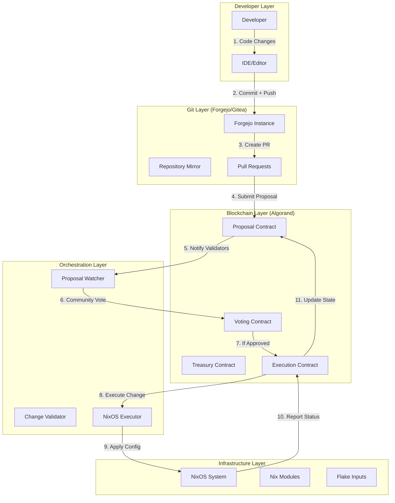
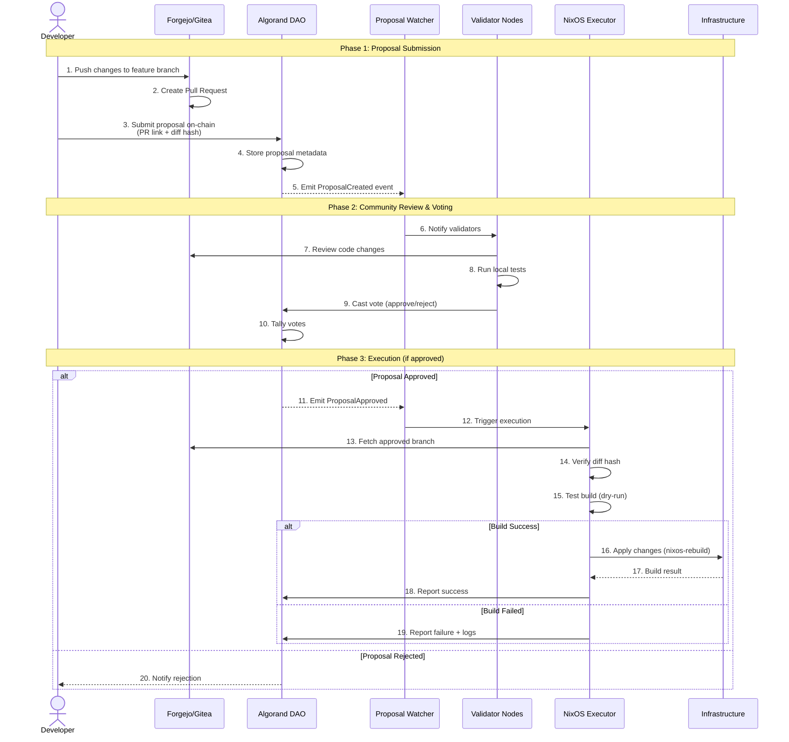
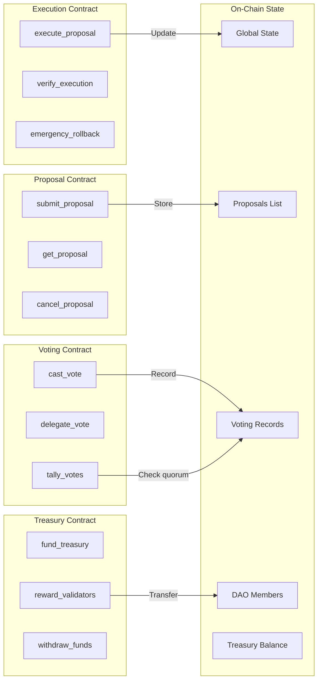
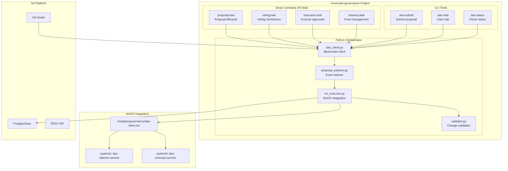
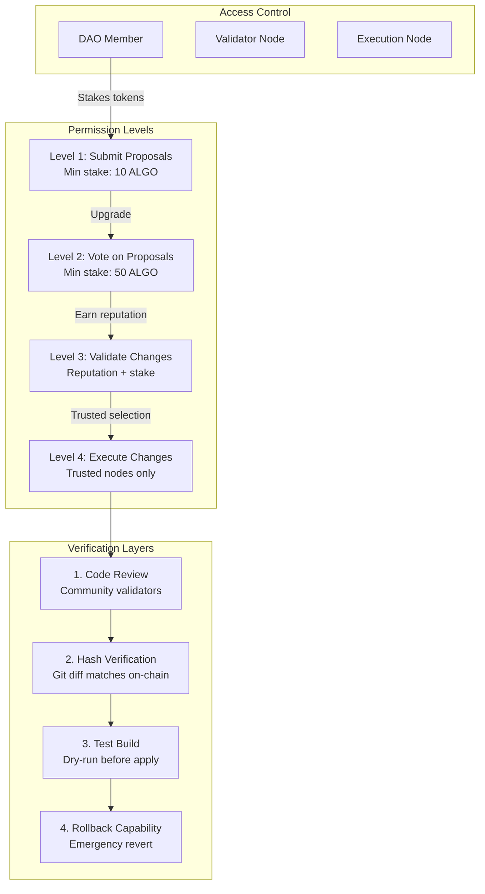
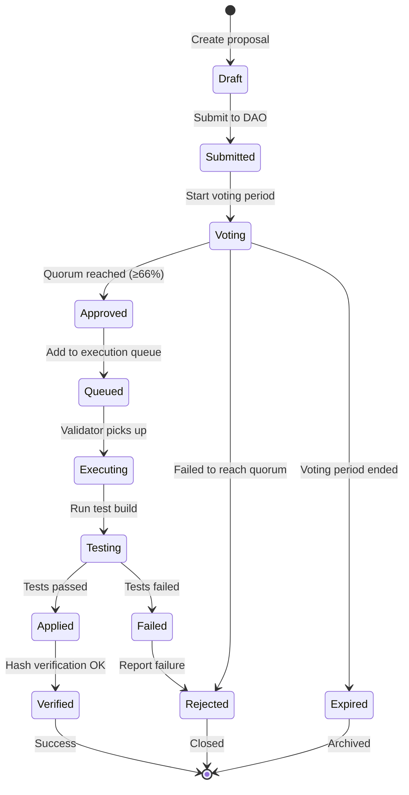
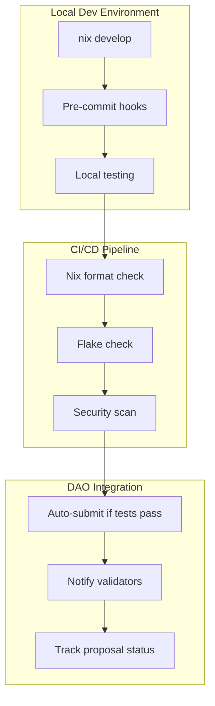
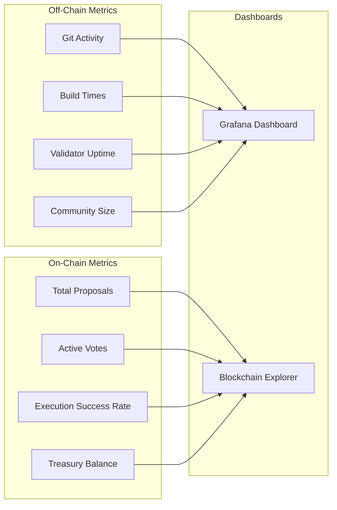
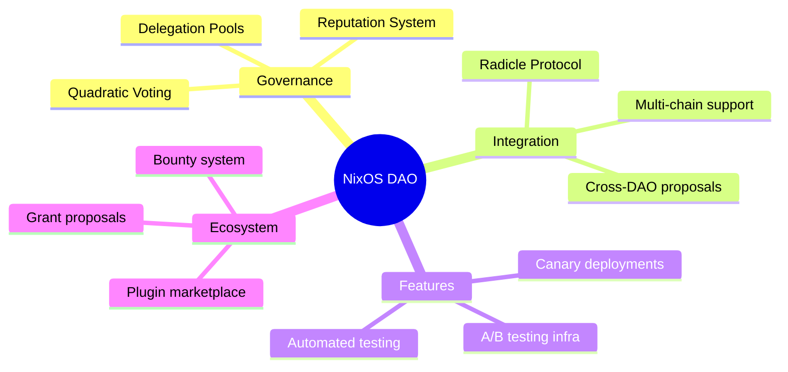

# 🌐 Enhancement: NixOS DAO Governance

**Status**: 🟡 DRAFT  
**Version**: v1.0  
**Author**: @kernelcore  
**Created**: 2025-12-30  
**Last Updated**: 2025-12-30  

## Vision

Radicle-inspired P2P infrastructure governance with Algorand smart contracts - enabling decentralized, transparent, and secure management of NixOS infrastructure changes through blockchain-based voting and automated execution.

## Problem Statement

Current infrastructure changes lack:
- **Decentralized governance** - Single points of control
- **Transparent decision-making** - Changes not publicly voted
- **Automated execution** - Manual intervention required
- **Accountability** - No on-chain audit trail
- **Community participation** - Limited contributor involvement

## Proposed Solution

---

## 🎯 High-Level Architecture



---

## 🔄 Detailed Workflow



---

## 🏗️ Smart Contract Architecture



---

## 📦 Component Architecture



---

## 🔐 Security Model



---

## 🌊 Data Flow

```mermaid
flowchart LR
    subgraph "Input"
        CODE[Code Changes]
        DIFF[Git Diff]
        HASH[SHA-256 Hash]
    end
    
    subgraph "On-Chain Storage"
        META[Proposal Metadata]
        VOTES_DATA[Voting Results]
        STATUS[Execution Status]
    end
    
    subgraph "Off-Chain Storage"
        GIT[Git Repository]
        IPFS[IPFS (optional)]
        LOGS[Execution Logs]
    end
    
    CODE --> DIFF
    DIFF --> HASH
    HASH --> META
    
    META --> GIT
    META --> IPFS
    
    VOTES_DATA --> STATUS
    STATUS --> LOGS
    
    LOGS -.->|Evidence| META
```

---

## 🎮 User Interactions



---

## 🔧 Integration Points



---

## 🚀 Deployment Architecture

```mermaid
graph TB
    subgraph "Desktop (Validator + Executor)"
        DESK_DAO[DAO Watcher Service]
        DESK_EXEC[Executor Service]
        DESK_VOTE[Voting Client]
    end
    
    subgraph "Laptop (DAO Member)"
        LAP_CLI[DAO CLI Tools]
        LAP_WALLET[Algorand Wallet]
    end
    
    subgraph "Shared Infrastructure"
        ALGO_NET[Algorand Network<br/>MainNet/TestNet]
        FORGE_SRV[Forgejo Server<br/>git.voidnxlabs:3443]
        IPFS_NODE[IPFS Node<br/>(optional)]
    end
    
    DESK_DAO <-->|Subscribe events| ALGO_NET
    DESK_EXEC <-->|Fetch changes| FORGE_SRV
    DESK_VOTE <-->|Cast votes| ALGO_NET
    
    LAP_CLI <-->|Submit proposals| ALGO_NET
    LAP_CLI <-->|Push code| FORGE_SRV
    LAP_WALLET <-->|Sign txns| ALGO_NET
    
    FORGE_SRV <-.->|Pin artifacts| IPFS_NODE
```

---

## 📊 Metrics & Monitoring



---

## 🎯 Success Criteria

1. **Decentralization**: No single point of failure
2. **Transparency**: All changes on-chain + public Git
3. **Security**: Multi-layer validation before execution
4. **Efficiency**: Proposals execute in <1 hour if approved
5. **Inclusivity**: Low barrier to entry (10 ALGO minimum)

---

## 🔮 Future Enhancements



---

*Architecture v1.0 - Ready for implementation review*  
*Created: 2025-12-30*
